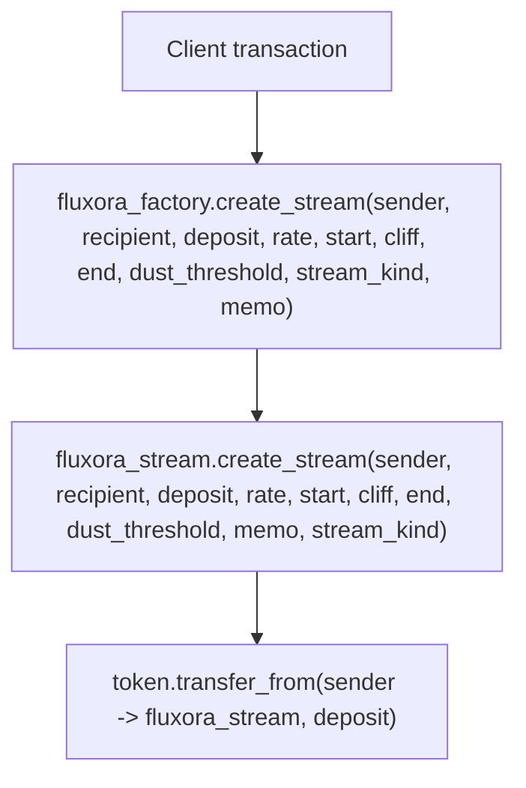

# Treasury Policy Factory Contract

The `fluxora_factory` contract is an optional wrapper around `FluxoraStream` designed specifically to enforce treasury compliance policies during stream creation.

## Overview

The base `FluxoraStream` contract is highly composable and intentionally un-opinionated about things like maximum stream sizes, minimum durations, and recipient identities. This makes it ideal as a protocol primitive. However, treasuries managing large token reserves often require strict operational policies. 

The `fluxora_factory` acts as a proxy entrypoint to enforce these policies:
- **Recipient Allowlist**: Streams can only be created for recipients explicitly allowlisted by the admin.
- **Deposit Caps**: Enforces a `MaxDepositCap` on the total `deposit_amount` of a single stream.
- **Optional Aggregate Batch Cap**: When enabled, the factory also rejects batches whose total deposit exceeds `MaxDepositCap`, preventing bypass by splitting across entries.
- **Minimum Duration**: Enforces a `MinDuration` (i.e. `end_time - start_time >= min_duration`), preventing overly short or instantaneous streams.
- **Time Relationship Checks**: Rejects invalid schedules before calling `FluxoraStream`. `start_time` must be strictly less than `end_time`, and `cliff_time` must be within the inclusive `[start_time, end_time]` window.

## Initialization & Stream Contract Validation

### Authorization contract

`init` requires the declared `admin` to authorize the call via
`admin.require_auth()`, exactly like every other admin-only entrypoint
(`set_admin`, `set_stream_contract`, `set_allowlist`, `set_cap`,
`set_min_duration`, all of which route through the shared `require_admin`
helper). Without this, any unrelated caller could front-run bootstrap by
calling `init` first and seeding the factory with an admin address they
control, before the intended admin's transaction lands.

`init` checks `AlreadyInitialized` before requiring auth, so a doomed
re-initialization call does not need to pay for, or supply, an authorization
entry — `admin.require_auth()` is only evaluated once it is known the call
could otherwise succeed.

### Stream contract validation

Both `init` and `set_stream_contract` validate the supplied `stream_contract`
address before persisting it. The factory invokes the read-only
`FluxoraStream::version()` entrypoint via `FluxoraStreamClient::try_version`.
Because `try_version` uses `Env::try_invoke_contract` internally, a missing
contract, an EOA (non-contract) address, or a deployed contract that does not
expose `version()` is caught as a typed error and returned as
`FactoryError::InvalidStreamContract`, instead of letting the bad address be
stored and only discovered later when `create_stream` host-traps on the
cross-contract call into `FluxoraStream::create_stream`.

`version()` is intentionally cheap and storage-free, and is documented to
work even before the target `FluxoraStream` contract's own `init` has been
called — so the smoke check never depends on the stream contract's
initialization state.

A failed validation leaves existing state untouched:
- In `init`, no instance storage keys are written if `stream_contract` fails
  validation; a subsequent `init` call with a valid address can still
  succeed.
- In `set_stream_contract`, the previously configured `stream_contract` is
  left in place if the new address fails validation.

## Policy Parameter Validation

Policy parameters are validated before they are written by `init`, `set_cap`,
and `set_min_duration`. Invalid values are rejected at write time so the later
`create_stream` policy checks remain meaningful and cannot be silently bricked by
nonsensical stored configuration. Failed setter calls leave the previously stored
policy unchanged.

| Parameter | Entrypoints | Accepted range | Rejection error | Notes |
|-----------|-------------|----------------|-----------------|-------|
| `max_deposit: i128` | `init`, `set_cap` | `1..=i128::MAX` | `FactoryError::InvalidCap` | `0` and negative caps are rejected because every positive stream deposit would exceed them. |
| `min_duration: u64` | `init`, `set_min_duration` | `0..=3_153_600_000` seconds (`MAX_MIN_DURATION_SECONDS`, 100 365-day years) | `FactoryError::InvalidMinDuration` | `0` is valid and means no additional factory-level minimum duration beyond the required `start_time < end_time` invariant. |

These ranges are also documented in the Rust `///` comments on the factory
entrypoints. Error discriminants are append-only; new variants are added without
renumbering existing values.

## Time Validation

The factory mirrors the underlying stream contract's creation-time schedule invariants and returns typed factory errors before making the cross-contract call:

| Condition | Error |
|-----------|-------|
| `start_time >= end_time` | `FactoryError::InvalidTimeRange` |
| `cliff_time < start_time` | `FactoryError::InvalidCliff` |
| `cliff_time > end_time` | `FactoryError::InvalidCliff` |

These checks keep invalid treasury requests on the factory error surface instead of relying on downstream stream-contract panics.

## Read-Only Views

The factory exposes read-only views so UIs, operators, and indexers can inspect policy before routing treasury activity through the wrapper.

| View | Returns | Notes |
|------|---------|-------|
| `get_factory_config()` | `FactoryConfig { admin, stream_contract, max_deposit, min_duration, batch_cap_enforced, creation_paused, min_rate_per_second, max_rate_per_second }` | Reads all instance policy fields. Returns every field tracked by `FactoryPolicy` plus `admin`, matching the single-call completeness of `load_policy`. Returns `FactoryError::NotInitialized` before `init`. |
| `is_allowlisted(recipient)` | `bool` | Returns `true` only when the recipient currently has an allowlist entry. Missing entries return `false`. |

These views are permissionless and do not mutate factory state.

## Important Bypass Warning

> [!WARNING]
> Because the underlying `FluxoraStream` contract does not natively enforce these policies, **they are only enforced if the stream is created by routing through the factory contract.**
>
> If a user (e.g. the treasury multi-sig itself) directly calls `create_stream` on the `FluxoraStream` contract, **all** factory-level policies are bypassed — recipient allowlist, deposit cap, minimum duration, rate bounds, creation pause, and aggregate batch cap. The stream contract only enforces its own independent invariants (positive deposit, valid time range, cliff within bounds, deposit covers rate × duration). This behavior is confirmed by regression tests in `contracts/factory/tests/factory_stream_e2e.rs` (`test_direct_stream_call_bypasses_recipient_allowlist`, `test_direct_stream_call_bypasses_deposit_cap`, `test_direct_stream_call_bypasses_minimum_duration`).
>
> This is the expected architecture: the factory is an optional policy wrapper, not a security boundary. Anyone who knows the stream contract's address can create streams that violate every factory rule. To truly lock down treasury funds, the token vault or multi-sig must be configured to *only* approve transactions that invoke the `fluxora_factory` contract — not the stream contract directly.

## Stream Kind and Memo

`FluxoraFactory::create_stream` accepts two additional parameters that are
forwarded verbatim to `FluxoraStream::create_stream`:

| Parameter | Type | Description |
|-----------|------|-------------|
| `stream_kind` | `fluxora_stream::StreamKind` | `StreamKind::Linear` (standard time-vesting) or `StreamKind::CliffOnly` (full deposit unlocked at cliff). |
| `memo` | `Option<soroban_sdk::Bytes>` | Optional opaque correlation bytes stored on the stream and readable via `get_stream_memo`. Length is validated early by the factory against `fluxora_stream::MAX_MEMO_BYTES` returning `FactoryError::InvalidMemo` before the cross-contract call. |

All policy checks (allowlist, deposit cap, minimum duration, time invariants,
rate bounds, memo length) are enforced **before** the cross-contract call, regardless of
`stream_kind`. A `CliffOnly` stream is subject to exactly the same treasury
policy guards as a `Linear` stream.

## Memo Length Validation

The factory enforces an early memo length guard (Guard 8) on both `create_stream` and `create_streams`:

| Condition | Shared Constant | Rejection Error |
|-----------|-----------------|-----------------|
| `memo.len() > fluxora_stream::MAX_MEMO_BYTES` | `fluxora_stream::MAX_MEMO_BYTES` (256 bytes) | `FactoryError::InvalidMemo` |

This guard directly references the shared constant `fluxora_stream::MAX_MEMO_BYTES` at compile time, guaranteeing that any update to the stream contract's maximum memo length is automatically reflected in factory validation without risk of version drift or stale limits. Oversized memos are rejected on the factory error surface before initiating cross-contract calls or side-effects.

Regression coverage for this behavior lives in `contracts/factory/tests/factory_stream_e2e.rs`: the suite now asserts that the factory memo guard tracks the shared `fluxora_stream::MAX_MEMO_BYTES` constant and that a memo one byte over the limit is rejected as `FactoryError::InvalidMemo` before the cross-contract call is made. This protects the factory from silently drifting away from the stream contract's own memo limit if the shared constant is ever changed.

For `CliffOnly` streams the `rate_per_second` argument is ignored — the stream
contract sets the effective rate to `0` internally.


The factory contract follows the Checks-Effects-Interactions (CEI) pattern implicitly:
1. **Checks**: Validates the recipient against the allowlist, validates the stream time relationship, and bounds the deposit and duration against the configured caps.
2. **Effects**: No local persistent state changes occur during a successful stream creation.
3. **Interactions**: Makes a cross-contract call to `FluxoraStream::create_stream` or `FluxoraStream::create_streams`.

## Batch creation semantics

`FluxoraFactory::create_streams` is an atomic batch wrapper around `FluxoraStream::create_streams`.
- Each entry is validated against the factory policy individually.
- Each recipient in the batch must be allowlisted.
- Each stream must individually satisfy the per-stream cap, minimum duration, and any configured rate-per-second bounds (MinRatePerSecond and MaxRatePerSecond).
- When `batch_cap_enforced` is enabled, the sum of all `deposit_amount` values in the batch is also checked against `MaxDepositCap`.
- A single invalid entry causes the entire batch to revert, ensuring no partial or policy-violating streams can be created.

> **Note:** The factory intentionally uses the atomic `create_streams` endpoint rather than `create_streams_partial` to ensure strict, all-or-nothing treasury policy compliance. For more details on the difference between atomic and partial batch creation at the stream contract level, see [Batch Creation: Atomic vs Partial](streaming.md#batch-creation-atomic-vs-partial).

### Registry writes for batch creation

After the downstream `FluxoraStream::create_streams` call succeeds, the factory appends every returned stream ID to the `FactoryStreamIds` persistent registry **in creation order** with a single TTL bump for the whole batch. This ensures:

- `get_factory_stream_count` increases by the number of streams in the batch.
- `get_factory_streams_paginated` returns all batch IDs in insertion order.
- An empty batch produces no registry writes and leaves the count unchanged.
- IDs are only written after the cross-contract call succeeds; a downstream failure leaves no orphan index entries.

This mirrors the behaviour of the single `create_stream` path, which appends its one ID immediately after successful creation. The batch path is therefore equivalent to N sequential single-stream creations from the registry's perspective, but O(1) TTL bumps instead of O(N).

## Cross-contract authorization model

Factory-routed creation has one client-facing entrypoint, but the sender authorization
must cover both the wrapper call and the nested stream call:



The required authorization scopes are:

For `fluxora_factory.create_streams`, the sender must authorize the factory batch call and the nested `fluxora_stream.create_streams` sub-invocation in the same transaction.


| Signer | Scope | Why it is required |
| --- | --- | --- |
| `sender` | `fluxora_factory.create_stream(...)` with the exact wrapper arguments | `FluxoraFactory::create_stream` calls `sender.require_auth()` after policy checks pass. |
| `sender` | Nested `fluxora_stream.create_stream(...)` with the exact stream arguments the factory forwards | `FluxoraStream::create_stream` also calls `sender.require_auth()` before validating and pulling the deposit. |

This is not two independent user intents. A client should build the Soroban
authorization tree so the `sender` signs the factory invocation and its
`fluxora_stream.create_stream` sub-invocation in the same transaction. The nested
scope is intentionally narrow: it authorizes only the exact stream creation that
the factory forwards after enforcing recipient, cap, and duration policy.

The stream contract, not the factory, pulls `deposit_amount` from `sender` into
the stream contract during `fluxora_stream.create_stream`. The factory never
custodies the sender's tokens and has no standing privilege to spend sender
funds. If a later transaction tries to reuse the factory or a changed set of
arguments, the sender must authorize that new invocation tree again.

### Worked client-signing example

Assume a treasury UI wants to create this routed stream:

```text
sender = G_SENDER
recipient = G_RECIPIENT
deposit_amount = 1_000
rate_per_second = 1
start_time = 1_800_000_000
cliff_time = 1_800_000_000
end_time = 1_800_001_000
withdraw_dust_threshold = 0
```

The client prepares a transaction whose root host function invokes
`fluxora_factory.create_stream` with those values. During simulation/preparation,
the authorization tree must contain `G_SENDER` for the root factory call and the
nested `fluxora_stream.create_stream` sub-invocation with the forwarded
`stream_kind` and `memo` arguments.

`G_SENDER` signs that prepared authorization tree. The factory admin does not
sign stream creation unless the admin is also the `sender`. The recipient does
not sign creation. The recipient signs only later recipient-controlled actions
such as `withdraw` or `withdraw_to`.

### Single-auth vs dual-scope auth

For UI and wallet copy, describe the flow as "one sender signing session with two
scopes" rather than "two unrelated signatures":

1. The factory scope lets the sender opt into the treasury policy wrapper.
2. The stream scope lets the stream contract create the stream and pull exactly
   the authorized deposit from the sender.

If the client omits either scope, the transaction fails at the corresponding
`require_auth` call. If the sub-invocation arguments differ from the signed
arguments, the nested authorization is not valid for that call.

## Admin Controls

The factory has an `Admin` key managed via `set_admin`. The admin can:
- Call `set_allowlist` to grant or revoke recipient eligibility.
- Call `set_cap` to update the max deposit limit.
- Call `set_min_duration` to update the minimum duration requirement.
- Call `set_batch_cap_enforcement` to toggle aggregate batch-cap validation.
- Call `set_stream_contract` to upgrade or switch the underlying stream primitive if a new version is deployed. The new address must pass the same `FluxoraStream::version()` smoke check enforced in `init` (see [Initialization & Stream Contract Validation](#initialization--stream-contract-validation)); a bad address is rejected with `FactoryError::InvalidStreamContract` and the previous stream contract remains active.
- Call `set_rate_bounds` to configure optional inclusive rate-per-second bounds.

The factory admin can shape policy and the target stream contract, but cannot
spend sender funds by itself. A factory-routed stream still needs the `sender`
authorization described above, and the underlying stream contract still enforces
its own authorization table. See the [`docs/security.md` admin powers
section](security.md#admin-powers) for the protocol-wide admin boundary.

## Events

Every state-changing factory entrypoint emits a structured Soroban event so that
indexers, treasury dashboards, and monitoring tools can observe policy changes and
stream creation without re-reading storage. Topic symbols are ≤ 9 characters per
the `symbol_short!` constraint.

| Entrypoint | Topic | Data struct | Notes |
|---|---|---|---|
| `init` | `fct_init` | `FactoryInited { admin, stream_contract, max_deposit, min_duration }` | Emitted once on deployment. |
| `set_admin` | `AdminUpd` | `FactoryAdminUpdated { old_admin, new_admin }` | Mirrors the `AdminUpd` topic used in `FluxoraStream`. |
| `set_stream_contract` | `stm_upd` | `StreamContractUpdated { old_contract, new_contract }` | Emitted after the pointer is updated. |
| `set_allowlist` | `allow_upd` | `AllowlistUpdated { recipient, allowed }` | `allowed: true` = added; `false` = removed. Sufficient for an indexer to reconstruct membership. |
| `set_cap` | `cap_upd` | `CapUpdated { old_cap, new_cap }` | Both old and new values are included. |
| `set_min_duration` | `dur_upd` | `MinDurationUpdated { old_min_duration, new_min_duration }` | Both old and new values are included. |
| `set_rate_bounds` | `rate_bnd` | `RateBoundsUpdated { min_rate, max_rate }` | Carries the arguments passed by the caller; `None` means "unchanged". |
| `set_batch_cap_enforcement` | `batch_cap` | `BatchCapEnforcementUpdated { enabled }` | Emits `true` or `false` as set by the admin. |
| `set_factory_paused` | `factory` + `paused`/`resumed` | `bool` | Pre-existing event, unchanged. |
| `create_stream` (success) | `fct_strm` | `FactoryStreamCreated { stream_id, sender, recipient, deposit_amount, rate_per_second }` | Emitted only after the cross-contract call succeeds. Lets indexers attribute a stream to the policy-gated factory path. |

See [docs/events.md](events.md) for the complete event catalogue across all contracts.

## Storage Layout

The factory storage key enum is defined in
`contracts/factory/src/lib.rs:78-92`. The TTL constants used by the factory are
defined in `contracts/factory/src/lib.rs:18-28`.

At the 5-second ledger cadence referenced by the source comments, the literal
TTL constants are:

| Constant | Ledgers | Approximate duration | Storage tier |
|---|---:|---:|---|
| `INSTANCE_LIFETIME_THRESHOLD` | `17_280` | 1 day | Instance |
| `INSTANCE_BUMP_AMOUNT` | `120_960` | 7 days | Instance |
| `PERSISTENT_LIFETIME_THRESHOLD` | `17_280` | 1 day | Persistent |
| `PERSISTENT_BUMP_AMOUNT` | `120_960` | 7 days | Persistent |

> **Note:** The source comments currently describe `120_960` ledgers as
> approximately 60 days. Using the same 5-second ledger close assumption stated
> in the comments, `120_960` ledgers is approximately 7 days. This table
> documents the literal constants and their computed duration.

| `DataKey` variant | Storage tier | Key encoding | Value type | TTL policy and trigger | Source references |
|---|---|---|---|---|---|
| `Admin` | Instance | `DataKey::Admin` | `Address` | Written by `init` and `set_admin`. Instance TTL is extended by `bump_instance()` after those writes; because instance TTL is contract-wide, later successful instance bumps also keep this key alive. | Enum: `lib.rs:78-80`; reads: `lib.rs:100-104`, `760`; writes: `lib.rs:478`, `514`; TTL: `lib.rs:141-144`, `495`, `517` |
| `StreamContract` | Instance | `DataKey::StreamContract` | `Address` | Written by `init` and `set_stream_contract` after `FluxoraStream::version()` validation. Instance TTL is extended after those writes and after other successful `bump_instance()` calls. | Enum: `lib.rs:80`; reads: `lib.rs:312-316`, `537-545`, `762-766`; writes: `lib.rs:479-481`, `543-545`; TTL: `lib.rs:495`, `548` |
| `MaxDepositCap` | Instance | `DataKey::MaxDepositCap` | `i128` | Written by `init` and `set_cap` after cap validation. Read by policy loading and config views. Instance TTL is extended after successful writes and batch creation. | Enum: `lib.rs:81`; reads: `lib.rs:317-321`, `586-590`, `767-771`; writes: `lib.rs:482-484`, `592-594`; TTL: `lib.rs:495`, `597`, `1014` |
| `MinDuration` | Instance | `DataKey::MinDuration` | `u64` | Written by `init` and `set_min_duration` after duration validation. Read by policy loading and config views. Instance TTL is extended after successful writes and batch creation. | Enum: `lib.rs:82`; reads: `lib.rs:322-326`, `616-620`, `772-776`; writes: `lib.rs:485-487`, `622-624`; TTL: `lib.rs:495`, `627`, `1014` |
| `BatchCapEnforced` | Instance | `DataKey::BatchCapEnforced` | `bool` | Written as `true` by `init` and updated by `set_batch_cap_enforcement`. Read by `load_policy`, `get_factory_config`, and batch creation. Instance TTL is extended after successful writes and batch creation. | Enum: `lib.rs:83`; reads: `lib.rs:327-331`, `777-781`; writes: `lib.rs:488-490`, `643-645`; TTL: `lib.rs:495`, `648`, `1014` |
| `Allowlist(Address)` | Persistent | `DataKey::Allowlist(recipient)` where `recipient` is the address payload | `bool` when present; missing key means `false` | Written as `true` by `set_allowlist(..., true)` and removed by `set_allowlist(..., false)`. Read by `is_allowlisted`, `create_stream`, and `create_streams`. **Current TTL gap:** no `persistent().extend_ttl(...)` call is made for this key on writes or reads. | Enum: `lib.rs:84`; writes/removal: `lib.rs:561-568`; reads: `lib.rs:786-790`, `871-875`, `1025-1029`; gap verified against `extend_ttl` calls in `lib.rs:186-190`, `209-213` |
| `FactoryStreamIds` | Persistent | `DataKey::FactoryStreamIds` | `Vec<u64>` | Created lazily when the first factory-created stream ID is appended. Persistent TTL is extended on every single or batch append. Read-only views load the vector but do not extend persistent TTL. | Enum: `lib.rs:85-86`; reads: `lib.rs:148-152`, `794-805`; writes/TTL: `lib.rs:180-190`, `198-213`; append calls: `lib.rs:955`, `1084` |
| `CreationPaused` | Instance | `DataKey::CreationPaused` | `bool`; missing key means `false` | `init` does not write this key. `set_factory_paused` writes it and bumps instance TTL. `load_policy` and `is_factory_paused` default missing storage to `false`. | Enum: `lib.rs:87-88`; reads: `lib.rs:332-336`, `747-751`; writes: `lib.rs:724-726`; TTL: `lib.rs:729` |
| `MinRatePerSecond` | Instance | `DataKey::MinRatePerSecond` | `i128` when present; `None` means no lower bound | Written by `set_rate_bounds` only when `min_rate` is `Some`. `None` arguments leave the stored value unchanged. Read by `load_policy`, `set_rate_bounds` invariant checks, and factory creation policy checks. Instance TTL is extended after successful `set_rate_bounds` and batch creation. | Enum: `lib.rs:89-90`; reads: `lib.rs:337-338`, `686`, `903-907`, `1019`; writes: `lib.rs:672-674`; TTL: `lib.rs:695`, `1014` |
| `MaxRatePerSecond` | Instance | `DataKey::MaxRatePerSecond` | `i128` when present; `None` means no upper bound | Written by `set_rate_bounds` only when `max_rate` is `Some`. `None` arguments leave the stored value unchanged. Read by `load_policy`, `set_rate_bounds` invariant checks, and factory creation policy checks. Instance TTL is extended after successful `set_rate_bounds` and batch creation. | Enum: `lib.rs:91-92`; reads: `lib.rs:339-340`, `687`, `913-917`, `1020`; writes: `lib.rs:680-682`; TTL: `lib.rs:695`, `1014` |

### Indexer reconstruction

An indexer can reconstruct factory state from scratch by combining read views
with the factory event stream:

1. Read the current policy snapshot with `get_factory_config()`.
2. Read the creation pause with `is_factory_paused()`.
3. Page through `get_factory_streams_paginated(start_index, limit)` until all
   IDs from `get_factory_stream_count()` are collected.
4. Replay `FactoryInited`, `FactoryAdminUpdated`, `StreamContractUpdated`,
   `CapUpdated`, `MinDurationUpdated`, `RateBoundsUpdated`, pause/resume, and
   `FactoryStreamCreated` events from deployment to reconstruct historical
   changes.
5. Replay `AllowlistUpdated` events to reconstruct allowlist membership.
   `is_allowlisted(recipient)` can verify a known recipient, but the contract
   does not expose an enumerable allowlist view.

For rate bounds, treat `RateBoundsUpdated { min_rate: None }` or
`{ max_rate: None }` as "unchanged" for that side, matching the
`set_rate_bounds` implementation.

## Instance Storage TTL Management

The factory's entire configuration (Admin, StreamContract, MaxDepositCap, MinDuration, BatchCapEnforced, rate bounds, CreationPaused) is stored in **instance storage**, not persistent storage. Instance entries are automatically pruned by the Soroban ledger when their TTL (time-to-live) expires. A long-idle factory whose instance entries expire becomes uninitialized and bricks all admin operations — a denial-of-service against the contract itself.

To prevent expiration, the factory implements a `bump_instance` helper that:
- Extends the instance storage TTL to a safe threshold whenever the factory is actively used.
- Mirrors the governance contract's TTL constants for consistency across contracts.

### TTL Constants

```rust
const INSTANCE_LIFETIME_THRESHOLD: u32 = 17_280;   // Ledgers below which a bump is triggered
const INSTANCE_BUMP_AMOUNT: u32 = 120_960;         // Bump target; ~7 days at 5-second ledger close
```

### When Instance TTL is Bumped

- **`init()`**: Bumps TTL during factory initialization.
- **Most instance-storage admin setters**: `set_admin`,
  `set_stream_contract`, `set_cap`, `set_min_duration`,
  `set_batch_cap_enforcement`, `set_rate_bounds`, and `set_factory_paused` bump
  the instance TTL after a successful update.
- **Batch stream creation**: `create_streams` bumps instance TTL after loading
  policy and before validating the batch.
- **Current gaps**: `set_allowlist` writes persistent allowlist entries but does
  not bump persistent or instance TTL. `create_stream`, `get_factory_config`,
  `is_factory_paused`, `is_allowlisted`, `get_factory_stream_count`, and
  `get_factory_streams_paginated` read storage without extending TTL.

### Why It Matters

A factory that goes idle until its current instance-storage TTL expires can have
its instance entries pruned by the ledger. After a bump to `120_960` ledgers,
that window is approximately 7 days at 5-second ledger close. Subsequent calls
to `get_factory_config` or any admin setter will return
`FactoryError::NotInitialized`, preventing further operations until the factory
is re-initialized—an unrecoverable error on a deployed contract.

With the current implementation, successful instance-storage writes and batch
creation keep instance entries alive. A purely inactive factory is not kept
alive by read-only queries alone, and a factory that only receives single
`create_stream` calls does not currently extend instance TTL on that path.

### Security Note

TTL bumps are performed internally by the factory and do not require additional authorization. They operate on already-protected instance storage without exposing any new attack surface. The bump operation is local to the factory; it does not invoke external contracts or expose any caller-controlled parameters.

## Code alignment checklist

This document is aligned with the current implementation as follows:

- `FluxoraFactory::init`, `set_cap`, and `set_min_duration` validate policy
  ranges before writing factory configuration.
- Instance-storage setters and `create_streams` call `bump_instance()` to extend
  instance storage TTL. `set_allowlist`, read-only views, and single
  `create_stream` do not currently extend TTL.
- `FluxoraFactory::create_stream` enforces allowlist, cap, and duration checks
  before calling `sender.require_auth()`.
- The factory forwards `stream_kind` and `memo` verbatim to
  `FluxoraStream::create_stream`; all policy gates apply regardless of kind.
- `FluxoraStream::create_stream` calls `sender.require_auth()` before validating
  parameters and pulling `deposit_amount` from `sender`.
- `FluxoraFactory::create_streams` appends all returned stream IDs to the
  `FactoryStreamIds` registry in creation order after the cross-contract call
  succeeds, with a single TTL bump for the whole batch (see `append_stream_ids_batch`
  in `contracts/factory/src/lib.rs`).
- `contracts/stream/tests/factory_policy.rs` covers policy input validation,
  factory policy gates, `CliffOnly` kind forwarding, memo forwarding,
  append-only error discriminants, and admin-guarded policy updates.

## Storage Layout & DataKey Collision Audit

The `fluxora_factory` contract uses Soroban storage for configuration and state management. The `DataKey` enum defines all storage keys used by the contract.

### DataKey Enumeration & Parameterization

| DataKey Variant | Storage Type | Payload / Parameter | Value Type | Description |
|-----------------|--------------|---------------------|------------|-------------|
| `Admin` | Instance | None (unit variant) | `Address` | Address of the factory administrator. |
| `StreamContract` | Instance | None (unit variant) | `Address` | Address of the underlying `FluxoraStream` contract primitive. |
| `MaxDepositCap` | Instance | None (unit variant) | `i128` | Maximum allowable `deposit_amount` per stream or aggregate batch. |
| `MinDuration` | Instance | None (unit variant) | `u64` | Minimum allowable stream duration (`end_time - start_time`). |
| `BatchCapEnforced` | Instance | None (unit variant) | `bool` | Flag toggling aggregate batch deposit cap enforcement in `create_streams`. |
| `CreationPaused` | Instance | None (unit variant) | `bool` | Global pause flag for stream creation via factory. |
| `MinRatePerSecond` | Instance | None (unit variant) | `i128` | Optional inclusive lower bound on stream rate per second. |
| `MaxRatePerSecond` | Instance | None (unit variant) | `i128` | Optional inclusive upper bound on stream rate per second. |
| `Allowlist(Address)` | Persistent | `Address` | `bool` | Per-recipient eligibility flag (`true` if allowlisted). |
| `FactoryStreamIds` | Persistent | None (unit variant) | `Vec<u64>` | Persistent ordered list of all stream IDs created through this factory. |

### Collision Analysis

Soroban serializes `contracttype` enums by tagging each variant with a distinct discriminant index (0, 1, 2...) combined with its parameter payload during ScVal XDR encoding:

1. **Discriminant Isolation**: Each unit variant (`Admin`, `StreamContract`, `MaxDepositCap`, `MinDuration`, `BatchCapEnforced`, `FactoryStreamIds`, `CreationPaused`, `MinRatePerSecond`, `MaxRatePerSecond`) produces a unique XDR tuple `(VariantTag, ())`.
2. **Tuple Parameter Isolation**: Parameterized variants (like `Allowlist(Address)`) produce XDR tuples `(VariantTag, Address)`. Because `VariantTag` for `Allowlist` is distinct from all other variants, an `Allowlist(Address)` key can never collide with any unit variant or future parameterized variant with a different tag.
3. **Parameter Uniqueness**: Within `Allowlist(Address)`, each unique `Address` yields a distinct serialized key.

Therefore, key collisions are mathematically impossible across all valid inputs.

