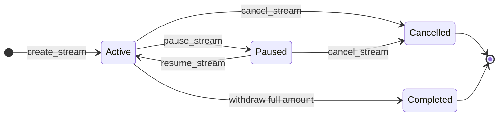
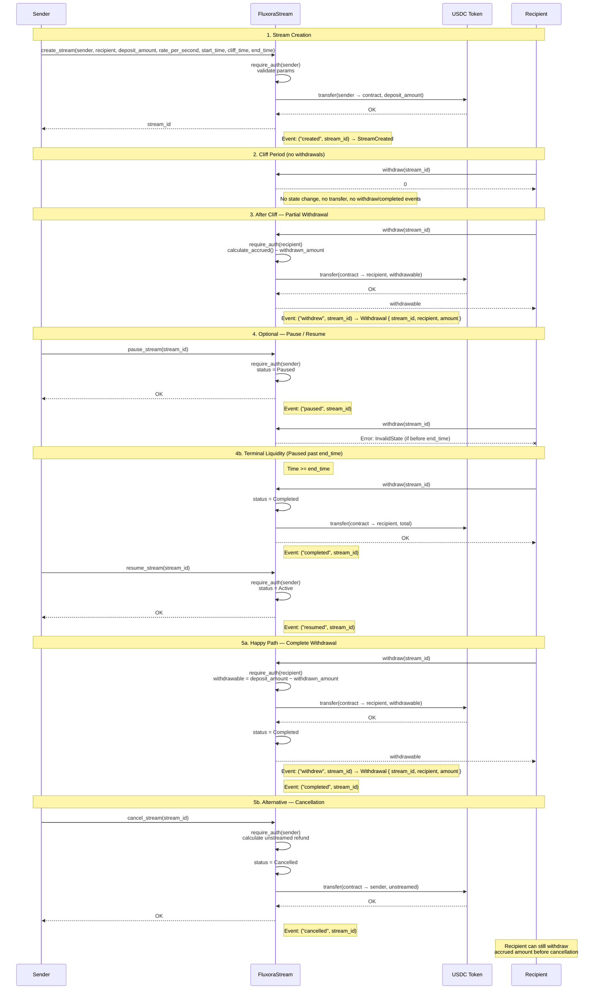

# Fluxora Stream Contract Documentation

Onboarding and integration reference for developers and auditors. Describes stream lifecycle, accrual formula, cliff/end_time behavior, access control, events, and error codes.

**Source of truth:** `contracts/stream/src/lib.rs`, `contracts/stream/src/accrual.rs`

**Alignment verification:** See [protocol-narrative-code-alignment.md](./protocol-narrative-code-alignment.md) for complete mapping between this documentation and implementation.

## Sync Checklist

When changing the contract:

- Update this doc if you change lifecycle, access control, events, or error semantics
- Update `protocol-narrative-code-alignment.md` to reflect changes
- Run `cargo test -p fluxora_stream` before committing
- Update snapshot tests if externally visible behavior changes
- No behavior change required for doc-only updates

**Entrypoint index (validator):** `accept_recipient_update`, `batch_withdraw_to`, `bulk_cancel_streams`, `bulk_resume_streams_as_admin`, `cancel_recipient_update`, `close_cancelled_stream`, `close_completed_stream`, `compute_keeper_fee_split`, `create_stream_with_lookback`, `delete_stream_template`, `get_auto_renew`, `get_global_emergency_paused`, `get_lookback_window`, `get_paused_stream_count`, `get_pending_recipient_update`, `get_protocol_fees_accrued`, `get_recipient_stream_count`, `get_stream_health`, `get_stream_memo`, `get_stream_template`, `get_total_liabilities`, `global_resume`, `keeper_cancel`, `renew_stream`, `set_auto_renew`, `set_contract_paused`, `set_global_emergency_paused`, `set_lookback_window`, `version`, `migration_v5_to_v6`, `set_max_rate_per_second`.
**Entrypoint index (validator):** `accept_recipient_update`, `batch_withdraw_to`, `bulk_cancel_streams`, `bulk_resume_streams_as_admin`, `cancel_recipient_update`, `delete_stream_template`, `get_auto_renew`, `get_global_emergency_paused`, `get_keeper_fee_split`, `get_pending_recipient_update`, `get_recipient_stream_count`, `get_stream_health`, `get_stream_memo`, `get_stream_template`, `get_total_liabilities`, `global_resume`, `keeper_cancel`, `renew_stream`, `set_auto_renew`, `set_contract_paused`, `set_global_emergency_paused`, `version`, `migration_v5_to_v6`, `set_max_rate_per_second`.
**Entrypoint index (validator):** `accept_recipient_update`, `batch_withdraw_to`, `bulk_cancel_streams`, `bulk_resume_streams_as_admin`, `cancel_recipient_update`, `close_cancelled_stream`, `close_completed_stream`, `compute_keeper_fee_split`, `delete_stream_template`, `get_auto_renew`, `get_global_emergency_paused`, `get_keeper_fee_split`, `get_paused_stream_count`, `get_pending_recipient_update`, `get_protocol_fees_accrued`, `get_recipient_stream_count`, `get_stream_health`, `get_stream_memo`, `get_stream_template`, `get_total_liabilities`, `global_resume`, `keeper_cancel`, `migration_v5_to_v6`, `renew_stream`, `set_auto_renew`, `set_contract_paused`, `set_global_emergency_paused`, `set_max_rate_per_second`, `version`.

## Externally Visible Assurances

This document provides crisp success and failure semantics for all protocol operations. Treasury operators, recipient applications, and auditors can reason about contract behavior using only:

1. **On-chain observables**: Persistent storage fields, emitted events, token transfers
2. **Published documentation**: This file and referenced specifications
3. **Error classifications**: Structured `ContractError` variants

No hidden rules or implementation details are required to understand protocol behavior.

### Per-stream metadata (TLV extension, CONTRACT_VERSION 4)

From **CONTRACT_VERSION 4**, every stream may carry an optional bounded key-value map
(`metadata: Option<Map<Bytes, Bytes>>`) for rich integration data such as invoice IDs,
project codes, and external reference URIs.

#### API

| Entrypoint | Description |
|---|---|
| `create_stream(…, metadata)` | Pass `Some(map)` to attach metadata at creation, or `None` to omit. |
| `get_stream_metadata(stream_id)` | Returns `Option<Map<Bytes, Bytes>>`. Permissionless read. |

Metadata is also propagated through `create_streams`, `create_streams_relative`,
`create_streams_partial`, and `create_stream_from_template` via the `metadata` field on
`CreateStreamParams` / `CreateStreamRelativeParams`.

#### Bounds (enforced at `create_stream` time — `ContractError::MetadataTooLarge` on violation)

| Bound | Constant | Value |
|---|---|---|
| Maximum key-value pair count | `MAX_METADATA_KEYS` | 8 |
| Maximum aggregate (all keys + values) bytes | `MAX_METADATA_BYTES` | 512 |
| Maximum single key length | `MAX_METADATA_KEY_BYTES` | 32 |
| Maximum single value length | `MAX_METADATA_VALUE_BYTES` | 128 |

#### Invariants

- Validated entirely at creation time; **immutable post-creation**.
- Stream ID is **not allocated** if metadata validation fails (no partial state written).
- No token movement occurs if metadata validation fails.
- `StreamCreated` event includes the `metadata` field for indexer consumption.

#### Example (Rust client)

```rust
let mut meta = Map::new(&env);
meta.set(Bytes::from_slice(&env, b"invoice_id"), Bytes::from_slice(&env, b"INV-2026-001"));
meta.set(Bytes::from_slice(&env, b"project"),    Bytes::from_slice(&env, b"PROJ-42"));

let stream_id = client.create_stream(
    &sender, &recipient,
    &deposit, &rate,
    &start, &cliff, &end,
    &0_i128, // dust threshold
    &None,   // memo
    &Some(meta),
);

// Later — permissionless read
let stored_meta = client.get_stream_metadata(&stream_id);
```

### Schedule templates (presets)

From **CONTRACT_VERSION 3**, integrators can register **relative** schedule skeletons (`register_stream_template`) and create streams from them (`create_stream_from_template`). This standardizes recurring payroll windows and trims repeated calldata versus always passing `start_delay` / `cliff_delay` / `duration` through the client for identical shapes.

- **Auth**: registering and deleting templates requires the template `owner` signer. Creating a stream from a template requires the **funding `sender`** to authorize (same as `create_stream_relative`).
- **Caps**: per-owner and global template counts are bounded; see `MAX_TEMPLATES_PER_OWNER` and `MAX_GLOBAL_TEMPLATES` in `contracts/stream/src/lib.rs`.
- **Errors**: `TemplateNotFound`, `TemplateLimitExceeded`, `TemplateUnauthorized`.

### Stream Kinds (Linear, CliffOnly, and CliffSlope)

From **CONTRACT_VERSION 4**, the contract supports distinct streaming styles, governed by the `StreamKind` field on the stream configuration:

- **Linear** (Default/Legacy): Accrues tokens continuously and linearly over time at `rate_per_second` once the stream has started, subject to a standard cliff window (during which nothing can be withdrawn).
- **CliffOnly**: A one-shot, instant unlock stream variant. Tokens do not accrue continuously over time. Instead:
  - Before the `cliff_time`, `0` tokens are accrued/withdrawable (all funds are locked).
  - At or after the `cliff_time`, the total `deposit_amount` is immediately and fully unlocked and made claimable by the recipient.
  - To enforce the single-unlock model, `rate_per_second` is forced to `0` during creation and all subsequent mutation/adjustment requests are rejected.
- **CliffSlope**: A post-cliff linear accrual variant. Tokens accrue linearly only after the cliff:
  - Before the `cliff_time`, `0` tokens are accrued/withdrawable (all funds are locked).
  - At or after the `cliff_time`, accrual begins from `0` and grows at `rate_per_second` until the `end_time` (or until `deposit_amount` is reached).
  - The contract validates that `rate_per_second > 0` and that the deposit covers the post-cliff schedule; rate changes and schedule mutations are rejected, similar to `CliffOnly`.

### Lookback-bounded withdrawals (CONTRACT_VERSION 8)

`calculate_accrued(stream_id)` always reports the stream's total lifetime accrual. It is
deliberately independent of the optional `max_lookback_ledgers` setting. The lookback
setting affects only the amount currently claimable by `withdraw`, `withdraw_to`, batch
withdrawal, delegated withdrawal, and auto-claim paths.

Use `create_stream_with_lookback(..., max_lookback_ledgers)` to configure the bound at
creation, or call `set_lookback_window(stream_id, sender, Some(ledgers))` later. `None`
clears the bound; `Some(0)` is rejected. One ledger is treated as five seconds, matching
the contract's ledger timing assumption.

When configured, a single claim is capped to the accrual represented by the most recent
`N` ledgers. Older unclaimed accrual remains represented by the unchanged
`withdrawn_amount` and can be claimed by subsequent calls in later windows. This limits
claim velocity, not entitlement: repeated withdrawals eventually release 100% of the
accrued amount. `get_withdrawable` and `get_claimable_at` return this bounded claimable
amount, while `calculate_accrued` continues to return the uncapped lifetime total.

CliffOnly streams are one-shot unlocks. Once the cliff has passed, their full deposit is
claimable even if the first query occurs after the lookback window; otherwise a missed
cliff would permanently strand the recipient's entitlement.

#### API

| Entrypoint | Auth | Purpose |
|---|---|---|
| `create_stream_with_lookback(..., max_lookback_ledgers)` | sender | Create a stream with an initial bound |
| `set_lookback_window(stream_id, sender, bound)` | sender only | Set or clear the bound on an existing stream |
| `get_lookback_window(stream_id)` | anyone (view) | Inspect the current bound, if any |
| `calculate_accrued(stream_id)` | anyone (view) | Lifetime accrual — **never** affected by the bound |
| `get_withdrawable(stream_id)` / `get_claimable_at(stream_id, t)` | anyone (view) | Bounded claimable amount |

#### Parameters

- `max_lookback_ledgers: Option<u32>` — number of ledgers back from the current
  point in time that defines one claim window.
- One ledger ≈ 5 seconds (matches Soroban ledger close cadence). `max_lookback_ledgers = 10`
  therefore covers the most recent ~50 seconds of accrual per claim.
- `None` removes the bound entirely (back to `accrued - withdrawn` per claim).
- `Some(0)` is rejected with `ContractError::InvalidParams` to avoid a meaningless
  zero-width window that would prevent any claim.

#### Success semantics (observable)

1. **Creation-time configuration**: `create_stream_with_lookback` writes the bound
   into `DataKey::MaxLookbackLedgers(stream_id)` (persistent storage) atomically
   with stream creation. The bound is only persisted if the stream itself is created
   successfully; token transfer failure or validation failure causes both to roll back.
2. **Setter**: `set_lookback_window` accepts the **current stream sender** as the
   authorising signer. It enforces:
   - `sender.require_auth()` — falsified signers cannot mutate the bound.
   - `sender == stream.sender` — only the original sender may apply a bound
     (recipients, admins, and third parties all get `ContractError::Unauthorized`).
   - Stream must not be `Cancelled` (cancelled streams get `ContractError::InvalidState`
     so post-cancel accounting is preserved verbatim).
   - `Some(0)` is rejected with `ContractError::InvalidParams`.
3. **Cap math** (per call to `get_withdrawable` / `get_claimable_at` / `withdraw` /
   `withdraw_to` / `batch_withdraw` / `batch_withdraw_to` / `delegated_withdraw` /
   `trigger_auto_claim`):
   ```
   window_seconds = max_lookback_ledgers * 5
   endpoint       = min(effective_time, stream.end_time)
   window_start   = endpoint.saturating_sub(window_seconds)
   recent_accrual = saturating_sub(
                       calculate_accrued_at(endpoint),
                       calculate_accrued_at(window_start))
   cap_normal     = max(0, recent_accrual)
   // CliffOnly bypasses the lookback so a recipient whose first claim
   // arrives after cliff_time + window_size does not strand funds.
   // See Security Notes § 2 for the rationale.
   cap            = if (kind == CliffOnly && accrued > 0) { accrued }
                    else                             { cap_normal }
   final          = max(0, min(claimable, cap))
   ```
   `calculate_accrued` is reused *twice* — once at the endpoint, once at the
   window-start — so checkpointing from `decrease_rate_per_second` and `update_rate_per_second`
   is fully respected. Final clamping is always non-negative even if arithmetic
   would otherwise underflow.

#### Failure semantics (observable)

| Condition | Error | Triggered by |
|---|---|---|
| `max_lookback_ledgers == Some(0)` | `InvalidParams` (3) | `create_stream_with_lookback`, `set_lookback_window` |
| `stream_id` does not exist | `StreamNotFound` (1) | `get_lookback_window`, `set_lookback_window` |
| Caller not the original stream sender | `Unauthorized` (7) | `set_lookback_window` |
| Stream is `Cancelled` | `InvalidState` (2) | `set_lookback_window` |
| Protocol is globally paused | `ContractPaused` (4) | `set_lookback_window` (admin entrypoints remain open) |

`set_lookback_window` failure is atomic: the bound is never partially written.

#### Lookback Security Notes

1. **No permanent loss invariant**. The cap limits the *velocity* of claims, not the
   *total* entitlement. Repeated calls across disjoint lookback windows recover 100%
   of `calculate_accrued(stream_id)`. The lifetime accrual is independent of the bound
   and is only ever reduced by valid `cancel_stream` / `cancel_stream_as_admin` flows,
   which freeze it at `cancelled_at`.

2. **CliffOnly bypass**. CliffOnly streams are a one-shot unlocking style — at and
   after `cliff_time` the entire deposit is claimable in a single round-trip. Forcing
   a CliffOnly stream to respect the lookback cap would strand the recipient if their
   first claim occurs after `cliff_time + window_size`. Therefore `apply_lookback_cap`
   treats `kind == CliffOnly && accrued > 0` as a special case that returns the
   capped claim without trimming. The `cap` is `accrued` itself in that scenario so the
   overall `claimable.min(cap)` still respects any other limits (dust threshold,
   contract balance, dust floor, etc.).

3. **Sender-only authorisation**. The bound is a sender privilege, not a recipient
   privilege. This prevents a recipient from opting into a generous cap unilaterally,
   and prevents admins from silently widening a sender's liability profile. The setter
   requires both `sender.require_auth()` and `sender == stream.sender`.

4. **Rate-limit interaction**. `MIN_WITHDRAW_INTERVAL_LEDGERS` from CONTRACT_VERSION 6
   still applies on top of the lookback. The recipient cannot bypass either limit by
   picking narrow or wide windows — the temporal guard forces at least ~17 ledgers
   (~85 s) between consecutive claims on the same stream regardless of bound.

5. **Time-terminal behaviour**. Once `now >= end_time`, accrual is capped at
   `deposit_amount`. The cap math uses `endpoint = min(now, end_time)` so a recipient
   that observes the stream long after `end_time` still has `recent_accrual` reflecting
   only the last `window_seconds` of deposit saturation, which can be small relative to
   the full deposit. The recipient can still drain the full deposit by performing enough
   windows-worth of claims (no permanent loss), but they pay the proportional
   transaction cost.

6. **Storage hygiene**. The bound lives in a per-stream persistent entry
   (`DataKey::MaxLookbackLedgers(stream_id)`). When the stream is closed via
   `close_completed_stream` or `close_cancelled_stream` (or removed by
   `cancel_stream` flow), the bound entry is removed in the same transaction so no
   orphaned storage accumulates.

7. **Discriminant ordering preserved**. The new `DataKey::MaxLookbackLedgers` variant
   is appended *last* to the enum so existing on-chain entries keep their discriminants
   and remain readable from pre-upgrade deployments (`CONTRACT_VERSION` bumped to 8).

### ID pre-allocation (`reserve_stream_ids`) — issue #584

Off-chain orchestrators and indexers that build payment batches often need to know stream IDs **before** submitting `create_stream` transactions, to pre-populate database records or cross-reference external invoice systems.

`reserve_stream_ids(caller, count)` atomically advances the global ID counter by `count` and returns the reserved range as a `Vec<u64>`.  Subsequent `create_stream` calls by the same `caller` consume IDs from the reservation in order; once exhausted (or if no reservation exists) the live counter is used.

| Constant | Value | Purpose |
|---|---|---|
| `MAX_ID_RESERVATION` | 100 | Cap per call — prevents counter-inflation attacks |
| `RESERVATION_TTL_LEDGERS` | 17 280 (~1 day) | Reservation expiry — abandoned ranges do not block the counter forever |

**Security notes:**
- `count = 0` -> `ReservationCountZero` (17).
- `count > 100` -> `ReservationLimitExceeded` (18).
- A new reservation for the same caller **overwrites** the previous one; the old IDs remain as a gap in the counter (same as any abandoned reservation).
- The TTL ensures persistent storage entries are cleaned up automatically.

**Usage pattern:**
```
1. Call reserve_stream_ids(caller, N)  → get [id_0, id_1, …, id_{N-1}]
2. Pre-populate off-chain DB with those IDs
3. Submit N create_stream transactions — each consumes the next reserved ID in order
```

---

## 1. Stream Lifecycle

### Phases

| Phase            | Action                                        | Notes                                                                 |
| ---------------- | --------------------------------------------- | --------------------------------------------------------------------- |
| **Creation**     | `create_stream` / `create_streams_partial` | Sender deposits tokens; stream starts as `Active`                     |
| **Clone**        | `clone_stream`                                | Copies rate, cliff offset, threshold, and memo from a source stream; accepts new recipient and timing |
| **Top-up**       | `top_up_stream`                               | Extra deposit locked (sender or admin only); schedule unchanged       |
| **Pause**        | `pause_stream` / `pause_stream_as_admin`      | Stops withdrawals; accrual continues by time                          |
| **Resume**       | `resume_stream` / `resume_stream_as_admin` / `bulk_resume_streams_as_admin` | Restores withdrawals; blocked if past `end_time` (Terminal); batch is atomic |
| **Cancellation** | `cancel_stream` / `cancel_stream_as_admin` / `bulk_cancel_streams` | Refunds unstreamed amount; frozen accrued stays for recipient         |
| **Withdrawal**   | `withdraw` / `withdraw_to` / `batch_withdraw` | Recipient pulls accrued tokens; allowed on Paused if past `end_time`  |
| **Completion**   | Automatic                                     | When `withdrawn_amount == deposit_amount`, status becomes `Completed` |
| **Auto-renewal** | `set_auto_renew` / `renew_stream`             | Sender opts in; anyone can trigger the next identical schedule from the sender's allowance |
| **Rotation**     | `update_recipient` / `accept_recipient_update` / `cancel_recipient_update` | Sender proposes a new recipient; the current recipient must accept. Pending rotations are queryable via `get_pending_recipient_update`. Acceptance updates both the stream record and recipient indexes atomically. |
| **Transfer**     | `transfer_claim_ownership`                    | Claim owner (or recipient if not set) transfers the sole withdrawal rights to a new owner immediately. |
| **Auto-claim**   | `set_auto_claim` / `revoke_auto_claim` / `trigger_auto_claim` | Recipient opts in to permissionless final claim at `end_time` to a chosen destination |
| **Delegation**   | `delegate_recipient_share`                    | Recipient delegates a portion of their future stream accrual (in basis points) to a new recipient. Creates a child stream and reduces parent rate. Bounded to a maximum depth of 3 to prevent unbounded chains. Cyclical delegation is prevented. |

### State Transitions

- **Active** ↔ **Paused** (via pause/resume)
- **Active** or **Paused** → **Cancelled** (terminal)
- **Active** or **Paused** → **Completed** (when recipient withdraws full deposit; terminal)

Terminal states: `Completed`, `Cancelled`. Both may be closed via `close_completed_stream` to reclaim storage and index space. A stream is also considered technically terminal if `ledger.timestamp() >= end_time`.
In this "time-terminal" state, pause/resume is blocked, but withdrawal is always allowed regardless of previous pause status.

**Cancelled stream closure rule**: A `Cancelled` stream may only be closed after the recipient has fully withdrawn the frozen accrued amount. Attempting to close a `Cancelled` stream with remaining claimable balance returns `ContractError::InvalidState`. This prevents storage cleanup from destroying recipient funds.

### Auto-renew subscription streams (CONTRACT_VERSION 7)

Auto-renewal supports recurring payroll and subscription payments without granting a
relayer authority to redirect funds.

1. The original sender calls `set_auto_renew(stream_id, sender, true)`. Only that sender
    may enable or disable the setting. Cancelled streams cannot be enabled.
2. After the recipient has fully withdrawn the stream and its status is `Completed`, any
    caller may call `renew_stream(stream_id)`.
3. Renewal pulls exactly the old stream's `deposit_amount` from the original sender to
    the contract using the sender's pre-approved token allowance. The recipient is copied
    from the completed stream; the caller supplies no source or destination address.
4. The new stream starts at the current ledger timestamp and preserves the original
    duration, rate, cliff offset, stream kind, memo, and withdrawal dust threshold. The
    new stream is itself auto-renew-enabled.

The consumed old opt-in is disabled before the token interaction. Successful renewal
therefore cannot be replayed against the same completed stream. If the sender's token
balance or allowance is insufficient, the call returns the dedicated
`ContractError::AutoRenewFundingUnavailable` error and creates no new stream or event.
Token transfer failures are atomic as well: state, liabilities, and the opt-in revert
together with the failed transaction.

### Cancellation Semantics (Issue Scope)

This section is the protocol-level contract for `cancel_stream` and `cancel_stream_as_admin`.

Success semantics (observable):

1. Preconditions: stream status is `Active` or `Paused`.
2. `cancelled_at` is set to current ledger timestamp.
3. Accrued amount is frozen at `cancelled_at` (no post-cancel time growth).
4. Refund is `deposit_amount - accrued_at_cancelled_at`.
5. Stream transitions to terminal `Cancelled` state.
6. `StreamCancelled` event is emitted with topic `("cancelled", stream_id)`.

Failure semantics (observable):

1. Missing stream: `ContractError::StreamNotFound`.
2. Non-cancellable status (`Completed` or already `Cancelled`): `ContractError::InvalidState`.
3. Modification in terminal state (past `end_time` for pause/resume): `ContractError::StreamTerminalState`.
4. Unauthorized caller on sender path: `ContractError::Unauthorized`.
5. Unauthorized caller on admin path: `ContractError::Unauthorized`.
6. Redundant state change (pause already paused): `ContractError::StreamAlreadyPaused`.
7. Redundant state change (resume already active): `ContractError::StreamNotPaused`.
8. Any failure is atomic: no refund transfer, no state mutation, no cancel event.

Role boundaries:

1. `cancel_stream`: only the stream `sender` can authorize.
2. `cancel_stream_as_admin`: only contract `admin` can authorize.
3. Recipient and third parties cannot cancel through either path unless they hold required credentials.

Invariants after successful cancellation:

1. `status == Cancelled` and `cancelled_at.is_some()`.
2. `calculate_accrued(stream_id)` always returns accrued at `cancelled_at`.
3. `refund + frozen_accrued == deposit_amount`.
4. Recipient may withdraw only frozen accrued remainder (`frozen_accrued - withdrawn_amount`).

Scope boundary and exclusions:

1. In scope: refund math, `cancelled_at` persistence/freeze semantics, cancel auth paths, cancel event consistency.
2. Out of scope: token-level trust assumptions beyond documented model, off-chain indexer liveness, and economic policy choices (for example who should bear operational costs).
3. Residual risk: if a non-standard token violates SEP-41 expectations, transfer behavior may diverge; CEI ordering reduces but cannot fully eliminate external token risk.

### Keeper Cancellation & Fee Accounting

The `keeper_cancel` entrypoint allows any third-party keeper to cancel an expired, unwithdrawn stream after the grace period has elapsed.

**Fee Accounting Note**:
- The keeper fee (50 BPS) is deducted solely from the *unstreamed* refund bound for the sender.
- The contract does **not** retain a protocol split of this fee. The entire fee is transferred directly to the keeper.
- The view function `get_protocol_fees_accrued` (added in #623) tracks the cumulative total of keeper fees *paid out* of the contract, rather than an internal sweepable balance.
- **Accounting Invariant**: The contract's token balance must securely cover all remaining liabilities. Since the keeper fee is transferred entirely to the keeper and leaves the contract, the tracked total in `get_protocol_fees_accrued` is strictly monotone and safely independent of the contract's real-time asset/liability ratio.
- **Total Liabilities View**: The auth-free view function `get_total_liabilities` returns the sum of every stream's remaining (not-yet-withdrawn) balance, sourced from the instance-stored `DataKey::TotalLiabilities` counter. Integrators can cross-check it against the contract's token balance to confirm solvency: a positive gap represents a healthy buffer above the aggregate outstanding payout obligation; a negative gap would indicate under-collateralisation and warrants operator investigation. This view is read-only, requires no parameters, and recomputes lazily on each call.

### Clone Semantics

This section defines the success and failure behavior of `clone_stream`.

Success semantics (observable):

1. Preconditions: Source stream must be in `Active` or `Paused` status.
2. The contract creates a new stream inheriting the rate, cliff offset, dust threshold, and memo from the source stream.
3. The new stream is initialized in the `Active` status.
4. Tokens are pulled from the source stream's sender for the new deposit.

Failure semantics (observable):

1. Terminal source state: If the source stream status is `Completed` or `Cancelled`, the operation is rejected with `ContractError::StreamTerminalState`.
2. Unauthorized: If the caller is not the sender of the source stream, the operation is rejected.

### Global Pause Semantics (Issue Scope)

This section is the protocol-level contract for the global pause state managed via `pause_protocol` and `resume_protocol`.

**Entrypoints:**

| Function | Description |
|----------|-------------|
| `pause_protocol(admin, reason)` | Globally pause new stream creation with audit trail (reason, timestamp, admin) |
| `resume_protocol(admin)` | Globally resume new stream creation, clearing audit trail |
| `is_paused()` | Query if protocol is currently paused (permissionless) |
| `get_pause_info()` | Query detailed pause info including audit trail (permissionless) |
| `set_max_rate_per_second(max_rate)` | Admin-only governance entrypoint that sets the maximum allowed stream rate for future rate updates |

**Pause reason length:** The `reason` string passed to `pause_protocol` is bounded by `MAX_PAUSE_REASON_BYTES = 256`. Strings longer than 256 bytes are rejected with `ContractError::InvalidParams`. This prevents unbounded ledger-entry growth (Issue #513).

Success semantics (observable):

1. Preconditions: Caller must be the authorized contract `admin`.
2. Storage: The `CreationPaused` data key is set to `true` or `false` in instance storage.
3. Event: `ContractPaused(bool)` is emitted with topic `("paused_ctl",)`.
4. Effect on creation: When paused, `create_stream` and `create_streams` return `ContractError::ContractPaused` and all new stream creation is blocked.
5. Effect on existing streams: Active streams are intentionally unaffected. Withdrawals, top-ups, pause/resume/cancel operations on individual streams continue to function normally.

Failure semantics (observable):

1. Unauthorized caller on admin path: `ContractError::Unauthorized`.
2. Any failure is atomic: no storage mutation, no event emitted.

Role boundaries:

1. `pause_protocol` / `resume_protocol`: only the contract `admin` can authorize.
2. Senders and recipients cannot pause the global contract. Senders manage individual streams via `pause_stream`.

Invariants when globally paused:

1. No new streams can be persisted (no `created` events, no deposit tokens pulled).
2. Existing streams do not change status due to a global pause.
3. Audit trail (reason, timestamp, admin) is queryable via `get_pause_info()`.

Scope boundary: The global pause is strictly an administrative circuit breaker for new liabilities. It does not freeze funds of existing users or prevent recipients from withdrawing their vested entitlement.

**Note on Stream Creation:**
Stream creation is blocked while the protocol is globally paused. The `create_stream` function returns `ContractError::ContractPaused` if `is_paused()` is true. This applies to both single-stream and batch (`create_streams`) creation.



### Contract-owned senders (vaults, multisigs)

The `create_stream` function and its variants authenticate the `sender` uniformly via `sender.require_auth()`. This pattern seamlessly supports both externally-owned Stellar accounts and smart contract addresses (such as treasury vaults or multisig contracts) without any special-cased code paths.

When a contract creates a stream:
- **Authorization**: The calling contract naturally authorizes the action via the standard Soroban authentication framework.
- **Funding**: Tokens are debited from the contract's token balance (the contract must have sufficient funds).
- **Management**: The contract acts as the stream's sender for all lifecycle operations, meaning only the contract can call `top_up_stream`, `cancel_stream`, `decrease_rate_per_second`, etc.
- **Refunds**: If a stream is cancelled or shortened, the unstreamed tokens are refunded directly to the sender's contract address.

**Caveat**: Ensure that `sender == recipient` validation (if enforced off-chain or via UI) and refund logic correctly account for contract addresses exactly as they would for standard accounts. The streaming protocol treats them identically.


### Sequence Diagram

The following diagram shows the full create → withdraw flow, including optional pause/resume and cancel paths.



---

## 2. Accrual Formula

**Location:** `contracts/stream/src/accrual.rs`

The mathematical accrual behavior branches on the stream's `StreamKind`:

### Linear Streams
```text
if current_time < cliff_time           → return 0
if checkpointed_at >= end_time or rate < 0 → return checkpointed_amount or 0

elapsed_now = min(current_time, end_time)
elapsed_seconds = elapsed_now - checkpointed_at   // 0 if underflow
added = elapsed_seconds * rate_per_second         // on overflow → deposit_amount
return min(checkpointed_amount + added, deposit_amount).max(0)
```

### Units, Precision, and Rounding
- **Time limits:** All time evaluations (like `elapsed_seconds`) are computed in whole **seconds**.
- **Rate and Amount:** `rate_per_second` is expressed in **base token units per second** (integer), and amounts are in **base token units**.
- **Rounding Direction:** The contract uses exact integer math. There are no fractional seconds or fractional tokens. Any division resulting in precision loss must occur *prior* to contract interactions (e.g., frontend converting a monthly rate to integer tokens-per-second, essentially flooring it). Internally, exact multiplication provides an integer step-function corresponding to second boundaries.

### Cliff-Only Streams
```text
if current_time < cliff_time  → return 0
else                         → return deposit_amount
```

#### CliffOnly accrual

`CliffOnly` streams are lump-sum unlocks, not continuous streams. Unlike
`Linear` streams, they do not multiply elapsed seconds by `rate_per_second`
after the cliff. Once `current_time >= cliff_time`, the accrued amount is the
full `deposit_amount`, clamped to the deposited ceiling. The configured
`rate_per_second` is therefore not part of CliffOnly accrual; valid CliffOnly
state stores `rate_per_second = 0` to preserve the one-shot model.

Worked example: before the cliff

```text
deposit_amount  = 1_000
rate_per_second = 0
start_time      = 1_000
cliff_time      = 1_600
end_time        = 2_000
current_time    = 1_599

current_time < cliff_time
accrued = 0
```

At `1_599`, the stream has not reached its unlock timestamp. A `Linear` stream
may have time-based accrual hidden behind the cliff, but a `CliffOnly` stream
has no partial accrual to expose.

Worked example: at or after the cliff

```text
deposit_amount  = 1_000
rate_per_second = 0
start_time      = 1_000
cliff_time      = 1_600
end_time        = 2_000
current_time    = 1_750

current_time >= cliff_time
accrued = min(deposit_amount, deposit_amount) = 1_000
```

At `1_750`, the recipient's lifetime accrual is the full deposit. The result
remains `1_000` at `end_time` or later. The clamp guarantees CliffOnly accrual
never exceeds `deposit_amount`.

### Rules

- **Before cliff:** Returns 0 (no withdrawals allowed)
- **After cliff:** Accrual computed from `start_time`, not from cliff
- **No cliff:** Set `cliff_time = start_time` for immediate vesting
- **After end_time:** Elapsed time is capped at `end_time` (no post-end accrual)
- **Overflow:** Multiplication overflow yields `deposit_amount` (safe upper bound)
- **Active streams:** Accrual computed using current ledger timestamp
- **Paused streams:** Accrual computed using current ledger timestamp (same as Active; pause only blocks withdrawals, not accrual)
- **Completed:** `calculate_accrued` returns `deposit_amount` (deterministic final value, timestamp-independent)
- **Cancelled:** `calculate_accrued` is frozen at `cancelled_at` (no post-cancel growth)

### Ledger-Time Monotonicity Guard

Ledger-backed accrual paths cache the last observed accrual timestamp in instance storage and compare each later ledger timestamp against it before evaluating withdrawable math. The guard is intentionally global and short-lived: it catches non-monotonic test harness setup, migration mistakes, or future environment changes without adding per-stream storage.

`accrual.rs` also contains a `debug_assert!(current_ts >= prev_ts, "retrograde ledger timestamp")`. In test/debug builds, the same condition returns `ContractError::ClockRegression` instead of allowing a retrograde timestamp to reduce computed accrual. Production Stellar ledgers are still assumed to be monotonically non-decreasing by protocol.

`get_claimable_at(stream_id, timestamp)` is exempt because the timestamp is caller-supplied simulation input rather than `ledger().timestamp()`.

### Ledger Sequence vs. Timestamp: Sequence-Independence Guarantee

**Guarantee:** Stream accrual is defined entirely in terms of `env.ledger().timestamp()` (wall-clock seconds). The ledger sequence number (block height) has **no influence** on the amount accrued or the amount withdrawable.

**Why this matters:** On the Stellar network the ledger sequence number and the UNIX timestamp advance independently. A burst of rapid ledger closes can push the sequence far ahead while the timestamp barely moves (e.g., 10 000 ledger closes in 400 seconds). Conversely, a slow-close period may hold the sequence near-constant while wall-clock time advances normally. Any accidental dependency on `env.ledger().sequence()` inside the accrual path would make recipient payout amounts sensitive to network block-production rate rather than actual elapsed time — a fund-accuracy issue.

**Where sequence numbers are used (intentionally):**

| Usage | Location | Purpose |
|---|---|---|
| `MIN_PAUSE_INTERVAL_LEDGERS` | `pause_stream` / `resume_stream` | DoS cooldown: prevents rapid pause/resume toggling (17 ledgers) |
| `MIN_WITHDRAW_INTERVAL_LEDGERS` | `withdraw` / `batch_withdraw` / `delegated_withdraw` | DoS guard: prevents excessive ledger I/O from high-frequency polling (1 ledger) |
| `last_withdraw_ledger` | Per-stream storage | Tracks last successful withdrawal for the frequency guard above |
| `last_pause_toggle_ledger` | Per-stream storage | Tracks last pause/resume toggle for the cooldown guard above |

These are all **operational rate-limiting** mechanisms. None of them affect the mathematical accrual formula in `accrual.rs`.

**Verified by tests (`contracts/stream/tests/clock_monotonicity.rs`):**

- `sequence_advances_fast_timestamp_static_accrual_is_timestamp_only` — advances sequence to 10 000 while holding timestamp at 400 s. Asserts that `calculate_accrued` and `withdraw` both return 400, not 10 000. Any accidental sequence-to-accrual coupling would cause this test to fail.
- `timestamp_advances_sequence_static_normal_accrual_works` — holds sequence at 1 (the minimum needed to pass the withdrawal-frequency DoS gate) while advancing timestamp to 700 s. Asserts that accrual equals 700 and withdrawal succeeds, confirming that low-sequence environments do not suppress accrual.

**No accidental dependency found:** A review of `contracts/stream/src/accrual.rs` and `contracts/stream/src/lib.rs` confirmed that every call to `calculate_accrued_amount_checkpointed` passes `env.ledger().timestamp()` as the `now` argument. There is no code path that passes `env.ledger().sequence()` (or any function of it) into the accrual formula. The sequence-number usages listed above are in separate, clearly labelled guard blocks.

### Status-Specific Behavior Matrix

| Status    | Time Source            | Expected Behavior                      |
| --------- | ---------------------- | -------------------------------------- |
| Active    | env.ledger().timestamp | Accrual grows with wall-clock time     |
| Paused    | env.ledger().timestamp | Same as Active (accrual continues)     |
| Completed | N/A (ignored)          | Returns deposit_amount (deterministic) |
| Cancelled | cancelled_at           | Frozen at cancellation time            |

### Withdrawable Amount

```text
withdrawable = accrued - withdrawn_amount
```

### Withdrawal Dust Threshold (#423)

From **CONTRACT_VERSION 5**, senders can optionally set a `withdraw_dust_threshold` per stream to reduce fee and event spam from tiny micro-withdrawals.

- **Enforcement**: If `withdrawable < withdraw_dust_threshold`, the withdrawal returns `0` (no transfer, no event).
- **Exceptions (Threshold Ignored)**:
    - **Terminal State**: Once the stream reaches `end_time` or is `Cancelled`, the threshold is ignored to ensure the recipient can pull all remaining funds.
    - **Final Drain**: If the withdrawal would result in `withdrawn_amount == deposit_amount` (completing the stream), it is allowed even if the amount is below the threshold.
- **Default**: The threshold defaults to `0` if not specified at creation.

> **See also:** [dust-threshold.md](./dust-threshold.md) — formula for choosing a safe threshold value, worked USDC examples, a validation table, and guidance for template authors.

### Withdrawal Frequency Limit (#574)

From **CONTRACT_VERSION 6**, all withdrawal operations enforce a minimum ledger interval between consecutive withdrawals on the same stream to prevent excessive ledger entry generation and I/O costs from high-frequency polling.

- **Constant**: `MIN_WITHDRAW_INTERVAL_LEDGERS = 17` (approximately 1 minute at ~5 seconds per ledger close, subject to network conditions)
- **Enforcement**: `withdraw`, `delegated_withdraw`, and `batch_withdraw` all enforce `current_ledger - last_withdraw_ledger >= MIN_WITHDRAW_INTERVAL_LEDGERS`
- **Error**: Returns `ContractError::WithdrawalTooFrequent` (error code 17) if the interval check fails
- **Atomicity**: For `batch_withdraw`, if any stream in the batch violates the rate limit, the entire batch reverts
- **Per-Stream**: Each stream tracks its own `last_withdraw_ledger` independently
- **First Withdrawal**: Always succeeds (`last_withdraw_ledger` is initialized to 0 at stream creation)
- **State Update**: `last_withdraw_ledger` is updated to `env.ledger().sequence()` only after a successful withdrawal (withdrawable > 0)
- **Zero Withdrawable**: If a withdrawal returns 0 (before cliff, dust threshold, etc.), `last_withdraw_ledger` is not updated

**Invariant**: `current_ledger >= last_withdraw_ledger` at all times (guaranteed by monotonic ledger progression).

**Example**: If a withdrawal succeeds at ledger 100, the next withdrawal can occur at ledger 117 or later (100 + 17 = 117).

### Rate Adjustment Throttle

From **CONTRACT_VERSION 7** (or with issue #1018), both `update_rate_per_second` and `decrease_rate_per_second` enforce a minimum ledger interval to prevent spam and rapid rate oscillation within a single ledger window.

- **Constant**: `MIN_RATE_INTERVAL_LEDGERS = 17` (approximately 1.5 minutes)
- **Enforcement**: Checks `current_ledger - last_rate_change_ledger >= MIN_RATE_INTERVAL_LEDGERS`.
- **Error**: Returns `ContractError::RateCooldownActive` (error code 36) if the throttle is violated.
- **First Change Exempt**: The throttle does not block the very first rate change on a freshly created stream (`last_rate_change_ledger` is initialized to 0 at stream creation).
- **State Update**: `last_rate_change_ledger` is updated to `env.ledger().sequence()` only after a successful rate adjustment.

### Frontend: get_claimable_at (simulation)

`get_claimable_at(stream_id, timestamp)` is a read-only view that returns the amount that would be claimable (withdrawable) at an arbitrary timestamp. Use it for:

- **Planning:** "How much will be claimable at time T?" without sending a transaction.
- **Simulation:** Pass a future timestamp to show projected claimable amount.
- **Consistency:** For the current ledger time, result matches `get_withdrawable(stream_id)`.

Behaviour: Active/Paused streams use the given `timestamp` (clamped to schedule); Cancelled streams use `min(timestamp, cancelled_at)` so accrual is frozen at cancellation. Completed streams return 0.

### Frontend: get_stream_health (view summary)

`get_stream_health(stream_id)` returns a structured health summary for a stream.

- **is_underfunded**: `true` if the current `deposit_amount` is insufficient to cover the total tokens that will accrue by `end_time` at the current `rate_per_second`.
- **is_expired**: `true` if `ledger.timestamp() >= end_time` and the stream is not yet `Completed` or `Cancelled`.
- **accrued_to_date**: Real-time total tokens accrued since `start_time`.
- **remaining_deposit**: `deposit_amount - withdrawn_amount`. For cancelled streams, this reflects the unwithdrawn portion of the original deposit, even though the unstreamed portion has been refunded.
- **seconds_until_depletion**: Estimated seconds until the stream's deposit is fully exhausted by accrual. Capped at `end_time`. For cancelled streams, this continues to reflect the hypothetical depletion time based on the original rate.

Use this to show real-time health indicators in UIs, alert senders of underfunding, or notify recipients of expired streams ready for final withdrawal.

---

## 3. Cliff and end_time Behavior

### Cliff

- Must be in `[start_time, end_time]` (enforced at creation)
- Before `cliff_time`: accrued = 0, no withdrawals
- At or after `cliff_time`: accrual uses elapsed time from `start_time`, not cliff

### end_time

- Must satisfy `start_time < end_time`
- Accrual uses `min(current_time, end_time)` as the upper bound
- After `end_time`, accrued stays at `min((end_time - start_time) * rate_per_second, deposit_amount)`
- No extra accrual beyond `end_time`

### Deposit Validation

At creation:

```text
deposit_amount >= rate_per_second * (end_time - start_time)
```

The same sufficiency check is enforced when extending a stream's `end_time`:

```text
deposit_amount >= rate_per_second * (new_end_time - start_time)
```

If the existing deposit does not cover the extended duration, `extend_stream_end_time` returns `ContractError::InsufficientDeposit` and no state changes occur. Use `top_up_stream` first to increase the deposit, then extend.

### Mutation Restrictions on Cliff-Only Streams

To preserve the absolute one-shot unlock nature of a `[CliffOnly](#cliff-only-streams)` stream variant and guarantee its immutability post-creation, **all mutating endpoints are strictly blocked**. Attempting to call any of the following functions on a `[CliffOnly](#cliff-only-streams)` stream will return `[ContractError::UnsupportedStreamKind](./error.md#unsupportedstreamkind-17)` and revert all state changes:

- `top_up_stream`
- `update_rate_per_second`
- `decrease_rate_per_second`
- `shorten_stream_end_time`
- `extend_stream_end_time`

Any such attempt is atomic: no balances are transferred, no state is updated, and no events are emitted.

### Shorten `end_time` Semantics

`shorten_stream_end_time(stream_id, new_end_time)` is sender-only and only valid for `Active`/`Paused` streams.

Validation boundaries:
- `new_end_time > now`
- `new_end_time > start_time`
- `new_end_time >= cliff_time`
- `new_end_time < old_end_time`

On success:
- `new_deposit_amount = rate_per_second * (new_end_time - start_time)`
- `refund_amount = old_deposit_amount - new_deposit_amount`
- Contract persists `end_time` and `deposit_amount`, then transfers `refund_amount` to sender, then emits `end_shrt`.

On failure (`InvalidParams` or `InvalidState`):
- No state change
- No token transfer
- No `end_shrt` event

### Start Time Boundary (Creation)

- `start_time` **must be >= current ledger timestamp** at creation time.
- `start_time == now` is valid ("start now").
- `start_time < now` is rejected with `ContractError::StartTimeInPast`.
- Failure is atomic: no stream is persisted, no tokens move, and no `created` event is emitted.

**Limits Policy (Defense in Depth):**

- No arbitrary hard-coded caps (e.g. "max 1M tokens").
- The technical upper bound is `i128::MAX` or the underlying token's total supply.
- Rationale: Accrual math (in `accrual.rs`) is already overflow-safe via `checked_mul` and clamping.
- Application-specific limits should be handled in the frontend or factory contracts. Note that the factory's policies (allowlist, deposit cap, minimum duration) only apply when streams are created through the factory — direct calls to this contract bypass them entirely. See [factory.md § Important Bypass Warning](./factory.md#important-bypass-warning).

### Batch Creation: Atomic vs Partial

The contract provides two entrypoints for creating multiple streams in a single transaction. Both accept a vector of `CreateStreamParams` and require a single authorization from the `sender`. For both functions, providing an empty vector safely returns an empty result (`Ok(Vec::new())`) with no side effects and no token transfers.

#### `create_streams` (Atomic)

```rust
pub fn create_streams(
    env: Env,
    sender: Address,
    streams: Vec<CreateStreamParams>,
) -> Result<Vec<u64>, ContractError>
```

**Semantics:** All-or-nothing.
- The contract first validates all entries.
- If any single entry fails validation (e.g., `StartTimeInPast`, `InvalidParams`), the entire transaction reverts.
- A single bulk token transfer is made for the sum of all `deposit_amount`s. If the sender lacks sufficient balance for the aggregate total, the transaction reverts.
- Returns a `Vec<u64>` containing the new stream IDs in the exact order of the input.

#### `create_streams_partial` (Non-Atomic)

```rust
pub fn create_streams_partial(
    env: Env,
    sender: Address,
    streams: Vec<CreateStreamParams>,
) -> Result<Vec<CreateStreamResult>, ContractError>

pub struct CreateStreamResult {
    pub success: bool,
    pub stream_id: Option<u64>,
    pub error: Option<u32>,
}
```

**Semantics:** Failure isolation per entry.
- The contract attempts to create each stream independently.
- **Token Transfer Handling:** Tokens are pulled from the sender *per entry*. If an entry fails validation, it is skipped entirely (no tokens are pulled). If the per-entry token transfer fails, it is recorded as `InsufficientBalance` (error code 9).
- Subsequent entries continue processing normally regardless of prior failures.
- **Return Value:** Callers receive a `Vec<CreateStreamResult>` matching the input order. To learn which elements succeeded, callers iterate the result vector and check `result.success`. Successful entries include `Some(stream_id)`, while failed entries include `Some(error_code)`.

**Example:**
```rust
let results = contract.create_streams_partial(&sender, &params)?;
for (i, res) in results.iter().enumerate() {
    if res.success {
        println!("Stream {} created with ID {}", i, res.stream_id.unwrap());
    } else {
        println!("Stream {} failed with error code {}", i, res.error.unwrap());
    }
}
```

### Relative-Time Helpers: `create_stream_relative` and `create_streams_relative`

The contract provides convenience entry points that compute stream times relative to the current ledger timestamp, eliminating off-chain calculation errors that lead to `StartTimeInPast` failures.

#### Motivation

Off-chain applications often construct stream parameters ahead of time, e.g., "start 1 day from now". If there is clock drift between the application server and the Soroban ledger, the calculated `start_time` may already be in the past when the transaction is executed, causing `StartTimeInPast` rejection.

Relative-time helpers avoid this by deferring timestamp computation to the contract itself, which always has the authoritative ledger timestamp.

#### `create_stream_relative`

**Signature:**
```rust
pub fn create_stream_relative(
    env: Env,
    sender: Address,
    recipient: Address,
    deposit_amount: i128,
    rate_per_second: i128,
    start_delay: u64,     // Seconds to add to current timestamp
    cliff_delay: u64,     // Seconds to add to current timestamp
    duration: u64,        // Total seconds from start_time to end_time
) -> Result<u64, ContractError>
```


**Computation:**
```
current_time = env.ledger().timestamp()
start_time   = current_time + start_delay
cliff_time   = current_time + cliff_delay
end_time     = start_time + duration
```

**Validation:**
- Checks for overflow/underflow in all additions
- Delegates to `create_stream` with computed absolute times
- Inherits all validation rules: deposit sufficiency, cliff bounds, etc.
- **Never produces `StartTimeInPast`** error (computed times are always >= current_time)

**Example:**
```
// Create a stream starting in 1 day, cliff in 3 days, running for 30 days
contract.create_stream_relative(
    &sender,
    &recipient,
    &100_000_000,           // 100M tokens
    &1_157_407,             // ~1% per day
    &86400,                 // start_delay: 1 day
    &259200,                // cliff_delay: 3 days
    &2_592_000,             // duration: 30 days
)?;
```

#### `create_streams_relative`

**Signature:**
```rust
pub fn create_streams_relative(
    env: Env,
    sender: Address,
    streams_relative: Vec<CreateStreamRelativeParams>,
) -> Result<Vec<u64>, ContractError>
```

**Parameters (per entry):**
```rust
pub struct CreateStreamRelativeParams {
    pub recipient: Address,
    pub deposit_amount: i128,
    pub rate_per_second: i128,
    pub start_delay: u64,
    pub cliff_delay: u64,
    pub duration: u64,
}
```

**Batch semantics:**
- Empty batch returns `Ok(Vec::new())` with no side effects
- All entries are converted to absolute times (overflow checks per entry)
- Delegates to `create_streams` with converted parameters
- Atomic: all or nothing (any validation failure aborts entire batch)
- Single authorization and token transfer for all streams (gas efficient)

**Example:**
```
let params = vec![
    CreateStreamRelativeParams {
        recipient: alice,
        deposit_amount: 1000,
        rate_per_second: 1,
        start_delay: 0,           // Immediate
        cliff_delay: 0,           // Immediate
        duration: 86400,          // 1 day
    },
    CreateStreamRelativeParams {
        recipient: bob,
        deposit_amount: 2000,
        rate_per_second: 2,
        start_delay: 86400,       // 1 day delay
        cliff_delay: 172800,      // 2 day cliff
        duration: 2592000,        // 30 days
    },
];
contract.create_streams_relative(&sender, &params)?;
```

**Error handling:**
- `InvalidParams`: If any time offset causes u64 overflow, or if other validation fails (rate, deposit, cliff bounds, etc.)
- `ContractPaused`: If creation is globally paused
- All other errors: Same as `create_stream` / `create_streams`

---

## 4. Access Control

| Function                  | Authorized Caller             | Auth Check                                  |
| ------------------------- | ----------------------------- | ------------------------------------------- |
| `init`                    | Bootstrap admin signer (once) | `admin.require_auth()`                      |
| `create_stream`           | Sender                        | `sender.require_auth()`                     |
| `clone_stream`            | Source stream's sender        | `source.sender.require_auth()`              |
| `create_streams`          | Sender                        | `sender.require_auth()` (once per batch)    |
| `create_stream_relative`  | Sender                        | `sender.require_auth()`                     |
| `create_streams_relative` | Sender                        | `sender.require_auth()` (once per batch)    |
| `pause_stream`            | Sender                        | `sender.require_auth()`                     |
| `resume_stream`           | Sender                        | `sender.require_auth()`                     |
| `cancel_stream`           | Sender                        | `sender.require_auth()`                     |
| `withdraw`                | Recipient                     | `recipient.require_auth()`                  |
| `withdraw_to`             | Recipient                     | `recipient.require_auth()`                  |
| `batch_withdraw`          | Recipient                     | `recipient.require_auth()` (once per batch) |
| `calculate_accrued`       | Anyone                        | None (view)                                 |
| `get_withdrawable`        | Anyone                        | None (view)                                 |
| `get_claimable_at`        | Anyone                        | None (view)                                 |
| `get_config`              | Anyone                        | None (view)                                 |
| `get_stream_state`        | Anyone                        | None (view)                                 |
| `get_stream_health`       | Anyone                        | None (view)                                 |
| `get_streams_by_id_range` | Anyone                        | None (view, paginated)                      |
| `get_recipient_streams_paginated` | Anyone                  | None (view, paginated)                      |
| `pause_stream_as_admin`   | Admin                         | `admin.require_auth()`                      |
| `resume_stream_as_admin`  | Admin                         | `admin.require_auth()`                      |
| `bulk_resume_streams_as_admin` | Admin                    | `admin.require_auth()` (once per batch; atomic all-or-nothing) |
| `cancel_stream_as_admin`  | Admin                         | `admin.require_auth()`                      |
| `close_completed_stream`  | Anyone                        | None (permissionless terminal cleanup)     |
| `top_up_stream`           | Funder address                | `funder.require_auth()`                     |
| `create_stream_with_lookback` | Sender                    | `sender.require_auth()`                     |
| `set_lookback_window`     | Original stream sender        | `sender.require_auth()`                     |
| `get_lookback_window`     | Anyone                        | None (view)                                 |
| `set_auto_renew`          | Original stream sender        | `sender.require_auth()`                     |
| `renew_stream`            | Anyone                        | None (permissionless; funds fixed to original sender) |
| `get_auto_renew`          | Anyone                        | None (view)                                 |
| `update_rate_per_second`  | Sender                        | `sender.require_auth()`                     |
| `update_recipient`        | Recipient                     | `recipient.require_auth()`                  |
| `decrease_rate_per_second`| Sender                        | `sender.require_auth()`                     |
| `shorten_stream_end_time` | Sender                        | `sender.require_auth()`                     |
| `extend_stream_end_time`  | Sender                        | `sender.require_auth()`                     |
| `transfer_sender`         | Current stream sender         | `sender.require_auth()`                     |
| `set_auto_claim`          | Recipient                     | `recipient.require_auth()`                  |
| `revoke_auto_claim`       | Recipient                     | `recipient.require_auth()`                  |
| `trigger_auto_claim`      | Anyone                        | None (permissionless; destination fixed by recipient) |
| `get_auto_claim_destination` | Anyone                     | None (view)                                 |
| `delegated_withdraw`         | Relayer (ed25519 sig from recipient) | `relayer.require_auth()` + ed25519 sig |
| `get_delegated_nonce`        | Anyone                     | None (view)                                 |
| `release_id_reservation`     | Reservation holder         | `holder.require_auth()`                     |
| `reclaim_expired_id_reservation` | Anyone                 | None (permissionless cleanup)               |
| `get_total_liabilities`      | Anyone                     | None (view)                                 |

**Note:** Sender-managed functions (`pause_stream`, `resume_stream`, `cancel_stream`) require sender auth. Admin uses separate `_as_admin` entry points.

### Paginated Export Views (Issue #429)

Two bounded view entrypoints support off-chain export and migration without unbounded loops:

#### `get_streams_by_id_range(start_id, end_id, limit) -> Vec<Stream>`

Returns streams within an ID range with a strict result limit (capped at `MAX_PAGE_SIZE = 100`).

**Parameters:**
- `start_id: u64` — First stream ID (inclusive)
- `end_id: u64` — Last stream ID (inclusive). Use `u64::MAX` for open-ended.
- `limit: u64` — Max results (enforced ≤ 100)

**Semantics:**
- Returns streams in ascending ID order
- Skips closed/archived streams silently
- Empty range (`start_id > end_id`) returns empty vector
- Zero limit returns empty vector

**DoS Protection:**
- Hard limit of 100 streams per call regardless of requested `limit`
- Gas cost is O(result_count), not O(range_size)

**Migration Pattern:**
```rust
let total = client.get_stream_count();
let mut start = 0u64;
while start < total {
    let page = client.get_streams_by_id_range(&start, &(start + 99), &100);
    // Export page...
    start += page.len() as u64;  // Handle closed streams
}
```

#### `get_recipient_streams_paginated(recipient, cursor, limit) -> Vec<u64>`

Cursor-based pagination for recipient stream export (capped at `MAX_PAGE_SIZE = 100`).

**Parameters:**
- `recipient: Address` — Address to query
- `cursor: u64` — 0-based starting index
- `limit: u64` — Max results (enforced ≤ 100)

**Semantics:**
- Cursor is index into sorted recipient stream list
- Returns stream IDs in ascending order
- Empty result indicates end of data or cursor beyond bounds

**Pagination Pattern:**
```rust
let mut cursor = 0u64;
loop {
    let page = client.get_recipient_streams_paginated(&recipient, &cursor, &50);
    if page.is_empty() { break; }
    // Export page...
    cursor += page.len() as u64;
}
```

**Comparison with Unbounded Views:**

| Function | Use Case | Limit | Risk |
|----------|----------|-------|------|
| `get_recipient_streams` | Small portfolios (<100) | None | Memory exhaustion |
| `get_recipient_streams_paginated` | Large portfolios | 100/page | Bounded, safe |
| `get_streams_by_id_range` | Full contract export | 100/page | Bounded, safe |

### top_up_stream: Observable Semantics

`top_up_stream(stream_id, funder, amount)` is a deposit-only mutation for existing streams.

- Auth boundary: only `funder` must authorize. The contract does not require `funder` to be the stream sender or the contract admin.
- Allowed states: `Active` and `Paused` only. `Completed` and `Cancelled` return `ContractError::InvalidState`.
- Amount validation: `amount <= 0` returns `ContractError::InvalidParams`.
- State transition on success: only `deposit_amount` changes, and it increases by exactly `amount`.
- Preserved fields on success: `sender`, `recipient`, `start_time`, `cliff_time`, `end_time`, `rate_per_second`, `withdrawn_amount`, and `status`.
- Atomic failure semantics: failed auth, failed token pull, or arithmetic overflow revert the whole transaction, leaving balances, stored deposit, and emitted contract events unchanged.
- Event semantics: a successful top-up emits exactly one contract event with topics `("top_up", stream_id)` and payload `StreamToppedUp { stream_id, top_up_amount: amount, new_deposit_amount }`.

Treasury policy note: if an application wants to restrict who may fund streams, that policy must be enforced off-chain or in a wrapper contract. The base stream contract intentionally accepts any self-authorizing funder.

### decrease_rate_per_second: Observable Semantics

`decrease_rate_per_second(stream_id, new_rate_per_second)` allows the stream sender to safely reduce the streaming rate.
A naive decrease would retroactively lower the recipient's accrued tokens. To prevent this, the contract **checkpoints** the stream: it locks in the mathematical accrual up to the current timestamp under the old rate, and applies the new rate only moving forward.

- **Check-Effects-Interactions (CEI)**: Computes accrual, reduces deposit amount, persists stream state, and finally refunds the difference to the sender.
- **Rate Validation**: `0 < new_rate_per_second < current rate_per_second`.
- **Refund**: The sender receives a refund of `old_deposit - new_deposit`, where `new_deposit = checkpointed_amount + new_rate * remaining_seconds`.
- **Refund-non-negativity invariant**: The refund maths uses `checked_sub` (`old_deposit - new_deposit`), not `saturating_sub`. Any rate change whose `new_deposit` would **exceed** `old_deposit` — i.e. the new schedule streamable amount is *larger* than what has already been deposited — is rejected with `ContractError::ArithmeticOverflow`. The contract never silently grows a stream's deposit ceiling via `decrease_rate_per_second`; only `top_up_stream` adds new deposit, and `update_rate_per_second` re-prices under the existing ceiling. See `contracts/stream/tests/rate_decrease_after_withdraw.rs` for the regression coverage of this invariant.

#### Failures
- **Unauthorized**: Caller is not the original sender.
- **InvalidState**: Stream is already expired (`now >= end_time`).
- **StreamTerminalState**: Stream is Cancelled or Completed.
- **InvalidParams**: `new_rate_per_second <= 0` or `new_rate_per_second >= old_rate`.
- **ArithmeticOverflow**: `old_deposit < new_deposit` per the refund-non-negativity invariant above. The contract refuses to *grow* the stream's deposit ceiling via a rate decrease.

### update_rate_per_second: Observable Semantics

`update_rate_per_second(stream_id, new_rate_per_second)` allows the stream sender to increase the streaming rate for an existing stream.

#### Success Semantics (Observable)

- **Authorization**: Only the stream `sender` can authorize the call.
- **State Requirements**: Stream must be in `Active` or `Paused` status (not `Completed` or `Cancelled`).
- **Rate Validation**: `new_rate_per_second > 0` and `new_rate_per_second > current rate_per_second` (forward-only increases).
- **Deposit Coverage**: `deposit_amount >= new_rate_per_second * (end_time - start_time)` must hold.
- **Accrual Impact**: The accrual calculation uses the new rate retroactively for the entire elapsed time since `start_time`, ensuring accrued amounts are monotonically non-decreasing.
- **Partial Withdrawal Interaction**: `withdrawn_amount` remains unchanged. Withdrawable amount becomes `accrued (with new rate) - withdrawn_amount`.
- **Event**: Emits `("rate_upd", stream_id)` with `RateUpdated` payload including old/new rates and `effective_time`.
- **No State Changes**: `status`, `deposit_amount`, `withdrawn_amount`, schedule fields (`start_time`, `cliff_time`, `end_time`) are preserved.

#### Failure Semantics (Observable)

- **StreamNotFound**: Invalid `stream_id`.
- **Unauthorized**: Caller is not the stream sender.
- **InvalidState**: Stream is `Completed` or `Cancelled`.
- **InvalidParams**: `new_rate_per_second <= 0` or `new_rate_per_second <= old_rate`.
- **InsufficientDeposit**: `deposit_amount < new_rate_per_second * (end_time - start_time)`.
- **Atomicity**: Any failure reverts the entire transaction with no state changes or events.

#### Invariants

- Accrued amounts never decrease due to rate updates.
- Recipient entitlement is preserved or increased.
- Deposit coverage ensures the stream remains fully fundable at the new rate.

### transfer_sender: Observable Semantics

`transfer_sender(stream_id, new_sender)` allows the current stream sender to rotate the treasury key for an existing stream.

#### Success Semantics (Observable)

- **Authorization**: Only the current stream `sender` can authorize the call.
- **State Requirements**: Stream must be in `Active` or `Paused` status (not `Completed` or `Cancelled`).
- **Parameter Validation**: `new_sender != current_sender` and `new_sender != recipient`.
- **State Change**: `stream.sender` is updated to `new_sender`. All other fields are unchanged.
- **Immediate Effect**: `new_sender` gains all sender-role privileges (pause, resume, cancel, rate updates, schedule changes) immediately. `old_sender` loses them immediately.
- **Recipient Entitlement**: Unchanged. Accrued amounts, `withdrawn_amount`, and schedule are unaffected.
- **Event**: Emits `("sndr_xfr", stream_id)` with `SenderTransferred { stream_id, old_sender, new_sender }`.

#### Failure Semantics (Observable)

- **StreamNotFound**: Invalid `stream_id`.
- **Unauthorized**: Caller is not the current stream sender.
- **InvalidState**: Stream is `Completed` or `Cancelled`.
- **InvalidParams**: `new_sender == current_sender` or `new_sender == recipient`.
- **Atomicity**: Any failure reverts the entire transaction with no state changes or events.

#### Use Case

Treasury key rotation: when a treasury wallet is being rotated, the operator calls `transfer_sender` to hand over stream management rights to the new key without disrupting the recipient's accrual or requiring stream recreation.

### batch_withdraw: completed stream behavior

`batch_withdraw` processes each stream ID in order. A stream with status `Completed` **does not error** — it contributes a zero-amount result (`BatchWithdrawResult { stream_id, amount: 0 }`) and is skipped silently. No token transfer and no event are emitted for that entry. This allows callers to pass a mixed list of active and already-completed streams without pre-filtering.

A `Paused` stream **does** return `ContractError::InvalidState` and reverts the entire batch.

### One-Shot Init and Immutable Bootstrap

`init(token, admin)` has explicit externally observable bootstrap semantics:

- One-shot: first successful call writes `Config { token, admin }` and `NextStreamId = 0`.
- Auth boundary: the supplied `admin` address must authorize the call.
- Re-init failure: any second call returns `ContractError::AlreadyInitialised`.
- Failure atomicity: failed auth or re-init leaves bootstrap storage unchanged.
- Immutability boundary: `token` is immutable after init; `admin` can rotate only via `set_admin` with current-admin auth.

Residual assumption: deployment flow must ensure the intended bootstrap admin signs the first init transaction.

### create_streams: Batch Atomicity, Single Auth, and Empty Vector Semantics

`create_streams(sender, streams)` is the batch creation entrypoint for treasury operators and indexers.

#### Non-Empty Batch Semantics

- Single auth: only `sender` must authorize, and it is checked once for the entire batch.
- Batch validation: every entry is validated before token transfer or persistence.
- Atomic transfer: the contract pulls exactly `sum(deposit_amount)` once.
- Atomic persistence: if any entry fails validation (or total-deposit sum overflows), no stream is created.
- Event behavior: on success, one `created` event is emitted per created stream; on failure, no `created` events are emitted.
- Ordering guarantee: returned stream IDs are contiguous and in the same order as input entries.

#### Empty Vector Semantics

When `streams` is an empty vector:

**Success Behavior (Observable):**
- Returns `Ok(Vec::new())` (empty result vector)
- No tokens are transferred (total_deposit = 0, no `pull_token` call)
- No streams are persisted (stream count unchanged)
- No `StreamCreated` events are emitted
- Stream ID counter is not advanced
- Contract state remains unchanged
- Authorization is still required: `sender.require_auth()` is called and must succeed
- No errors are raised (empty batch is valid and succeeds)

**Failure Behavior (Observable):**
- If `sender` is not authorized: authorization failure before any state changes
- If contract is globally paused: `ContractError::ContractPaused` returned, no state changes
- Any failure is atomic: no state mutation, no token transfer, no events

**Invariants After Empty Batch:**
- Returned vector has length 0
- Stream count unchanged
- Token balances unchanged
- No new events in event log
- Recipient stream indices unchanged
- Multiple empty batches have identical observable effects (idempotent)

**Rationale:**
- Empty batch is a valid no-op: allows callers to submit conditional batches without special-casing
- Authorization is still required: maintains consistent auth semantics across all entry points
- No state advance: ensures stream IDs remain contiguous and predictable
- Idempotent: enables safe retry logic in integrators

#### Scope Note

These guarantees are limited to `create_streams` creation semantics. They do not change withdrawal, pause/resume, cancellation, or cleanup rules.

### batch_withdraw: Recipient-Only Auth, Completed Stream Handling, and Empty Vector Semantics

`batch_withdraw(recipient, stream_ids)` enforces recipient-only authorization and deterministic completion semantics:

### batch_withdraw_to: Per-Entry Destination Routing with Atomic Reversion

`batch_withdraw_to(recipient, withdrawals)` extends the same recipient-only authorization model to per-stream destinations. The recipient must authorize the batch, every stream must belong to that recipient, and the batch reverts atomically if any entry is unauthorized, invalid, or otherwise rejected. Destination addresses may be any non-contract address; routing to the contract address is rejected with `ContractError::InvalidParams`.

#### Non-Empty Batch Semantics

- Auth boundary: only the stream `recipient` can authorize `batch_withdraw`.
- Non-recipient calls fail before transfer/state/event side effects.
- Uniqueness check: `stream_ids` must not contain duplicates; duplicates return `ContractError::DuplicateStreamId` and revert the entire batch.
- Completed streams: contribute a zero-amount result and are skipped silently (no error, no event).
- Active/Paused streams: processed normally; `Paused` streams return `ContractError::InvalidState` and revert the entire batch.
- Event ordering on active final drain: `withdrew` is emitted before `completed`.

#### Empty Vector Semantics

When `stream_ids` is an empty vector:

**Success Behavior (Observable):**
- Returns `Ok(Vec::new())` (empty result vector)
- No streams are processed
- No tokens are transferred
- No events are emitted
- Contract state remains unchanged
- Authorization is still required: `recipient.require_auth()` is called and must succeed
- No errors are raised (empty batch is valid and succeeds)

**Failure Behavior (Observable):**
- If `recipient` is not authorized: authorization failure before any state changes
- If contract is globally paused: `ContractError::ContractPaused` returned, no state changes
- Any failure is atomic: no state mutation, no token transfer, no events

**Invariants After Empty Batch:**
- Returned vector has length 0
- No stream state changed
- Token balances unchanged
- No new events in event log
- Multiple empty batches have identical observable effects (idempotent)

**Rationale:**
- Empty batch is a valid no-op: allows callers to submit conditional batches without special-casing
- Authorization is still required: maintains consistent auth semantics across all entry points
- Idempotent: enables safe retry logic in integrators

---

### Auto-claim Opt-in Semantics

`set_auto_claim`, `revoke_auto_claim`, and `trigger_auto_claim` implement a recipient-controlled permissionless claim mechanism.

#### Overview

Recipients may opt in to have their final withdrawal triggered by any third party (keeper, bot, or user) once the stream reaches `end_time`. The destination address is chosen and stored on-chain by the recipient — no caller can redirect funds.

#### `set_auto_claim(stream_id, destination)`

- **Auth**: `recipient.require_auth()` — only the stream recipient may set or change the destination.
- **Constraints**: stream must exist and not be `Completed` or `Cancelled`; `destination` must not be the contract address.
- **Validation**: destination is validated to ensure it's not the zero address and not the contract itself.
- **Idempotent**: calling again with a new address overwrites the previous destination.
- **Event**: `("ac_set", stream_id)` → `AutoClaimSet { stream_id, destination }`.
- **Storage**: destination is stored in persistent storage under `DataKey::AutoClaimDestination(stream_id)`.

#### `get_auto_claim_status(stream_id) -> AutoClaimStatus`

Pre-flight check query that returns the auto-claim configuration status and claimable amount. This allows callers to validate before executing `trigger_auto_claim`, reducing failed transactions and wasted gas on invalid destinations.

- **Auth**: None required (read-only view function).
- **Returns**: `AutoClaimStatus` enum with three variants:
  - `NotSet`: No auto-claim destination has been configured for this stream.
  - `ValidDestination { destination, claimable }`: Destination is set and valid, with the current claimable amount.
  - `InvalidDestination { destination }`: Destination is set but invalid (zero address or contract itself).
- **Claimable calculation**: Computed as `accrued_amount - withdrawn_amount` at current timestamp, capped at 0.
- **Validation checks**:
  - Destination is not the zero address
  - Destination is not the contract address itself
- **Usage pattern**:
  ```rust
  let status = client.get_auto_claim_status(&stream_id);
  match status {
      AutoClaimStatus::ValidDestination { destination, claimable } => {
          if claimable > 0 {
              client.trigger_auto_claim(&stream_id);
          }
      }
      AutoClaimStatus::NotSet => {
          // No auto-claim configured
      }
      AutoClaimStatus::InvalidDestination { destination } => {
          // Destination is invalid, cannot trigger
      }
  }
  ```
- **Benefits**:
  - Prevents wasted gas on invalid destinations
  - Allows off-chain systems to batch valid claims
  - Provides transparency for keepers and bots
  - No state changes or side effects

#### `get_auto_claim_destination(stream_id) -> Option<Address>`

Simple query that returns the stored auto-claim destination address, or `None` if not set.

- **Auth**: None required (read-only view function).
- **Returns**: `Option<Address>` — the destination address if set, otherwise `None`.
- **Note**: Does not validate the destination. Use `get_auto_claim_status` for validation.

#### `revoke_auto_claim(stream_id)`

- **Auth**: `recipient.require_auth()`.
- **Idempotent**: safe to call even if no destination is set (no error, no event side-effects beyond the revoke event).
- **Event**: `("ac_revoke", stream_id)` → `AutoClaimRevoked { stream_id }`.

#### `trigger_auto_claim(stream_id)`

- **Auth**: **none** — permissionless. Any account may call this.
- **Preconditions** (all must hold):
  1. Stream exists.
  2. Stream is not `Completed` or `Cancelled`.
  3. `ledger.timestamp() >= stream.end_time` (time-terminal).
  4. Auto-claim destination is set (`AutoClaimNotSet` otherwise).
  5. Contract is not globally paused.
- **Accounting**: identical to `withdraw_to` — computes `accrued - withdrawn_amount`, caps by contract balance, updates `withdrawn_amount`, may transition to `Completed`.
- **Destination immutability**: tokens are sent to the address stored by the recipient. The caller cannot influence the destination.
- **Events**:
  - `("withdrew", stream_id)` → `Withdrawal { stream_id, recipient, amount }` (indexer compatibility).
  - `("ac_trig", stream_id)` → `AutoClaimTriggered { stream_id, destination, amount }`.
  - `("completed", stream_id)` → `StreamEvent::StreamCompleted(stream_id)` if stream transitions to `Completed`.

#### Cancellation interaction
 
If a stream is cancelled after opt-in, `trigger_auto_claim` returns `InvalidState`. The auto-claim destination entry remains in storage but is inert. Recipients may call `revoke_auto_claim` to clean up storage.
 
#### Revocation Boundary and Timing Safety
 
1. **Post-Revoke Trigger Prevention**: Once a recipient calls `revoke_auto_claim`, the auto-claim configuration is immediately deleted. Any subsequent `trigger_auto_claim` calls fail with `ContractError::InvalidParams` without transferring any tokens.
2. **Early Trigger Restriction**: Permissionless triggering is strictly disallowed before the stream's `end_time` is reached. Early calls return `ContractError::InvalidState` and transfer zero funds.
3. **Destination Update Immendiate Effect**: If the destination is updated, the change is immediately effective. Triggering auto-claim afterwards sends funds ONLY to the recipient's currently selected destination.
 
#### Security invariants
 
1. Only the recipient can set or change the destination (`require_auth` enforced).
2. The caller of `trigger_auto_claim` has zero influence over where tokens go.
3. CEI ordering is preserved: stream state is saved before the token transfer.
4. Global emergency pause blocks `trigger_auto_claim` (same as `withdraw`).

---

### delegated_withdraw: Relayer-Submitted Withdrawal with Minimum Amount Guard

`delegated_withdraw` allows a relayer (keeper, bot, or any third party) to submit a withdrawal on behalf of a recipient without requiring the recipient to sign a Soroban transaction themselves. The recipient instead signs an off-chain ed25519 message committing to the exact parameters of the withdrawal.

#### Signed message format

```
message = stream_id            (u64,  8 bytes, big-endian)
        | nonce                (u64,  8 bytes, big-endian)
        | deadline             (u64,  8 bytes, big-endian)
        | expected_minimum_amount (i128, 16 bytes, big-endian)
        | relayer_fee          (i128, 16 bytes, big-endian)
```

Total: 40 bytes (v8) / 56 bytes from `CONTRACT_VERSION = 9` (adds the 16-byte `relayer_fee` row).

#### `expected_minimum_amount` — front-running protection

Without this field, a relayer could delay the transaction until the accrued amount is much smaller than the recipient expected (e.g. after a rate decrease or near stream end), constituting a griefing vector. By committing to a minimum, the call reverts with `BelowMinimumAmount` (16) if `withdrawable < expected_minimum_amount`. Pass `0` to accept any positive amount.

#### `expected_minimum_amount` is evaluated against the recipient's **net** amount (`CONTRACT_VERSION = 9`)

Starting from `CONTRACT_VERSION = 9`, `delegated_withdraw` accepts an optional
signed `relayer_fee: i128` that the recipient authorises as part of the
signature payload (16 extra bytes appended in big-endian — see the layout table
above). The contract computes `gross_withdrawable` and
`net_amount = gross_withdrawable - relayer_fee`, then enforces
`expected_minimum_amount <= net_amount` (not `expected_minimum_amount <= gross_withdrawable`).

What this means for integrators:

| Scenario | Pre-v9 semantics (gross) | v9 semantics (net = gross − relayer_fee) |
|----------|--------------------------|------------------------------------------|
| `expected_minimum_amount = 10`, accrued `= 100`, `relayer_fee = 5` | success (100 ≥ 10) | success (recipient receives 95, relayer 5) |
| `expected_minimum_amount = 96`, accrued `= 100`, `relayer_fee = 5` | success (100 ≥ 96) | revert with `BelowMinimumAmount` (16) — recipient expected 96 but only receives 95 |
| `expected_minimum_amount = 99`, accrued `= 100`, `relayer_fee = 5` | success (100 ≥ 99) | revert with `BelowMinimumAmount` (16) — recipient expected 99, net is 95 |
| `expected_minimum_amount = 0`, accrued `= 100`, `relayer_fee = 50` | success | success (recipient 50, relayer 50) — `0` still means "any positive net" |

The relayer receives `relayer_fee` only when `gross_withdrawable >= relayer_fee`;
otherwise the whole call reverts with `BelowMinimumAmount` before any token
transfer is attempted (CEI: recipient's net is evaluated first, then
`push_token` to recipient, then `push_token` to relayer — two sequential
calls inside `delegated_withdraw`, in that order).

#### Nonce — replay protection

Each recipient has a per-address nonce stored in `DataKey::DelegatedWithdrawNonce(recipient)`. The nonce starts at 0 and is incremented on every successful `delegated_withdraw`. Replaying a used signature returns `InvalidSignature` (15). Query the current nonce via `get_delegated_nonce(recipient)`.

#### Failure semantics

| Condition | Error |
|-----------|-------|
| `ledger.timestamp() > deadline` | `InvalidSignature` (15) |
| `nonce != stored_nonce` | `InvalidSignature` (15) |
| ed25519 signature invalid | host trap (panic) |
| `withdrawable < expected_minimum_amount` | `BelowMinimumAmount` (16) |
| Stream paused (non-terminal) | `InvalidState` (2) |
| Stream completed | `InvalidState` (2) |

---

## 5. Events

### Event Schema

#### StreamCreated

Emitted when a new stream is created via `create_stream` or `create_streams`.

**Topic:** `("created", stream_id)`

**Payload:** `StreamCreated` struct containing:

- `stream_id` (u64): Unique identifier for the stream
- `sender` (Address): Address that created and funded the stream
- `recipient` (Address): Address that receives the streamed tokens
- `deposit_amount` (i128): Total tokens deposited
- `rate_per_second` (i128): Streaming rate in tokens per second
- `start_time` (u64): When streaming begins (ledger timestamp)
- `cliff_time` (u64): When tokens first become available (vesting cliff)
- `end_time` (u64): When streaming completes (ledger timestamp)

#### Withdrawal

Emitted when a recipient successfully withdraws tokens via `withdraw`.

**Topic:** `("withdrew", stream_id)`

**Payload:** `Withdrawal` struct containing:

- `stream_id` (u64): Unique identifier for the stream
- `recipient` (Address): Address that received the tokens
- `amount` (i128): Amount of tokens withdrawn

#### RateUpdated

Emitted when a sender successfully updates the streaming rate via `update_rate_per_second`.

**Topic:** `("rate_upd", stream_id)`

**Payload:** `RateUpdated` struct containing:

- `stream_id` (u64): Unique identifier of the stream
- `old_rate_per_second` (i128): The previous streaming rate
- `new_rate_per_second` (i128): The new streaming rate
- `effective_time` (u64): Ledger timestamp when the rate update became effective

#### Other Events

| Topic                      | Payload                                       | When Emitted                                       |
| -------------------------- | --------------------------------------------- | -------------------------------------------------- |
| `("created", stream_id)`   | `StreamCreated` (struct payload)              | `create_stream` / `create_streams`                 |
| `("cloned", stream_id)`    | `StreamCloned` (struct payload)               | `clone_stream` — carries `source_stream_id` for indexer correlation |
| `("paused", stream_id)`    | `StreamEvent::Paused(stream_id)`              | `pause_stream` / `pause_stream_as_admin`           |
| `("resumed", stream_id)`   | `StreamEvent::Resumed(stream_id)`             | `resume_stream` / `resume_stream_as_admin` / `bulk_resume_streams_as_admin` |
| `("cancelled", stream_id)` | `StreamEvent::StreamCancelled(stream_id)`     | `cancel_stream` / `cancel_stream_as_admin`         |
| `("withdrew", stream_id)`  | `Withdrawal { stream_id, recipient, amount }` | `withdraw`                                         |
| `("completed", stream_id)` | `StreamEvent::StreamCompleted(stream_id)`     | `withdraw` / `batch_withdraw` (active final drain) |
| `("rate_upd", stream_id)` | `RateUpdated` (struct payload)                | `update_rate_per_second`                          |
| `("closed", stream_id)`    | `StreamEvent::StreamClosed(stream_id)`        | `close_completed_stream`                           |
| `("top_up", stream_id)`    | `StreamToppedUp` (struct payload)             | `top_up_stream`                                    |
| `("renewed", old_stream_id, new_stream_id)` | `StreamRenewed { old_stream_id, new_stream_id }` | `renew_stream` |

---

## `withdraw_to` Destination Rules

`withdraw_to(stream_id, destination)` lets the recipient redirect accrued tokens to any address **except the contract itself**.

| Destination                  | Allowed | Error on rejection      |
| ---------------------------- | ------- | ----------------------- |
| Contract address (`env.current_contract_address()`) | ❌ No | `ContractError::InvalidParams` |
| Recipient address (self-redirect) | ✅ Yes | — |
| Sender address               | ✅ Yes  | —                       |
| Any other third-party address | ✅ Yes | —                       |

**Atomicity guarantee:** If the destination check fails, the call returns `InvalidParams` with **no side effects** — `withdrawn_amount` is not incremented, no token transfer occurs, and no event is emitted. The stream state is identical to its state before the call.

**Auth:** `recipient.require_auth()` is always enforced before the destination check.

---

## 6. Error Behavior (ContractError + Panics)

Errors are surfaced either as `ContractError` variants or as panic/assert messages.
Integrators should treat `ContractError` as stable error codes, and panic strings
as best-effort diagnostics. The table below focuses on creation and lifecycle
errors relevant to stream creation and timing.

| Message                                                                 | Function                           | Trigger                                       |
| ----------------------------------------------------------------------- | ---------------------------------- | --------------------------------------------- |
| `"already initialised"`                                                 | `init`                             | Re-init attempt                               |
| authorization failure                                                   | `init`                             | caller did not satisfy `admin.require_auth()` |
| `"deposit_amount must be positive"`                                     | `create_stream` / `create_streams` | deposit_amount <= 0                           |
| `"rate_per_second must be positive"`                                    | `create_stream` / `create_streams` | rate_per_second <= 0                          |
| `"sender and recipient must be different"`                              | `create_stream` / `create_streams` | sender == recipient                           |
| `"start_time must be before end_time"`                                  | `create_stream` / `create_streams` | start_time >= end_time                        |
| `"cliff_time must be within [start_time, end_time]"`                    | `create_stream` / `create_streams` | cliff out of range                            |
| `"deposit_amount must cover total streamable amount (rate * duration)"` | `create_stream` / `create_streams` | underfunded                                   |
| `"overflow calculating total streamable amount"`                        | `create_stream` / `create_streams` | overflow in rate \* duration                  |
| `"overflow calculating total batch deposit"`                            | `create_streams`                   | overflow in sum of deposits                   |
| `ContractError::StartTimeInPast`                                        | `create_stream` / `create_streams` | start_time < ledger timestamp                 |
| `ContractError::ClockRegression` (17)                                   | Ledger-backed accrual paths        | ledger timestamp < previous accrual timestamp |
| `ContractError::StreamAlreadyPaused` (10)                               | `pause_stream`                     | Double pause                                  |
| `ContractError::StreamNotPaused` (11)                                   | `resume_stream`                    | Resume active stream                          |
| `ContractError::StreamTerminalState` (12)                               | `pause_stream` / `resume_stream`   | Modification past end_time                    |
| `ContractError::StreamNotFound` (1)                                     | Various                            | Invalid stream_id                             |
| `[ContractError::UnsupportedStreamKind](./error.md#unsupportedstreamkind-17)` (17) | Mutating functions                 | Attempting to mutate a [CliffOnly](#cliff-only-streams) stream       |
| `ContractError::Unauthorized` (6)                                       | Various                            | Auth check failed                             |
| `ContractError::InvalidState` (2)                                       | `withdraw`                         | Withdraw from non-terminal paused             |
| `ContractError::InvalidState` (2)                                       | `cancel_stream`                    | Cancel completed/cancelled                    |
| `"invalid state for stream closure"`                                    | `close_completed_stream`           | Close non-terminal (Active/Paused) stream    |
| `ContractError::InvalidState` (2)                                       | `close_completed_stream`           | Close Cancelled stream with remaining claimable balance |
| `ContractError::AutoRenewFundingUnavailable` (36)                      | `renew_stream`                     | Original sender balance or allowance is below deposit amount |
| `ContractError::InvalidState` (2)                                       | `renew_stream`                     | Source is not Completed or auto-renew is disabled |
| `ContractError::InvalidParams` (3)                                      | `create_stream_with_lookback` / `set_lookback_window` | `max_lookback_ledgers == Some(0)` |
| `"contract not initialised: missing config"`                            | Functions requiring config         | Config missing                                |

## Protocol-Level Pausing

The protocol supports two distinct pausing modes managed by the contract admin. These modes allow for graduated intervention depending on the situation (e.g., routine maintenance vs. emergency exploit investigation).

### Pause Modes Comparison

| Mode | Flag | Blocked Operations | Allowed Operations |
|---|---|---|---|
| **Creation Only** | `CreationPaused` | `create_stream`, `create_streams` | `withdraw`, `cancel_stream`, `top_up_stream`, `update_rate_per_second`, `extend_stream_end_time`, `shorten_stream_end_time` |
| **Global Emergency** | `GlobalEmergencyPaused` | **ALL** mutation operations (Create, Withdraw, Cancel, Update, etc.) | `get_stream_state`, `calculate_accrued`, `close_completed_stream` (read-only and cleanup) |

### Gating Semantics

1. **Creation Functions**: Blocked if *either* `GlobalEmergencyPaused` or `CreationPaused` is set.
2. **Mutation Functions**: Blocked ONLY if `GlobalEmergencyPaused` is set.
3. **Read-Only Functions**: Never blocked; users can always calculate their accrued balance even during a total emergency pause.
4. **Admin Functions**: Never blocked; admins can always pause/resume the protocol or rotate the admin address.

### Observable Behavior

When an operation is blocked by a protocol-level pause, it returns `ContractError::ContractPaused` (4). No state changes occur, and no tokens are transferred.

---

## Error Reference

For a full list of contract errors, see [error.md](./error.md).

---

## Cross-References

### Related Documentation

- **[Protocol Narrative vs Code Alignment](./protocol-narrative-code-alignment.md)** - Complete verification that this documentation matches implementation
- **[Audit Documentation](./audit.md)** - Entrypoints and invariants for auditors
- **[Error Reference](./error.md)** - Complete error code catalog
- **[Security Guidelines](./security.md)** - Security considerations and best practices
- **[Storage Layout](./storage.md)** - Contract storage architecture
- **[Deployment Guide](./DEPLOYMENT.md)** - Step-by-step deployment checklist

### For Integrators

- **Treasury Operators**: See §1 (Lifecycle), §4 (Access Control), §5 (Events)
- **Recipient Applications**: See §2 (Accrual Formula), §4 (Withdrawal), §5 (Events)
- **Indexers**: See §5 (Events), §6 (Error Behavior)
- **Auditors**: See [protocol-narrative-code-alignment.md](./protocol-narrative-code-alignment.md) for complete verification
- **Factory/Policy Integrators**: The stream contract enforces no recipient allowlist, deposit cap, or minimum duration. These policies exist only in the factory contract and are bypassed by direct stream-contract calls. See [factory.md § Important Bypass Warning](./factory.md#important-bypass-warning) for details.

### Verification

This documentation is verified against implementation in [protocol-narrative-code-alignment.md](./protocol-narrative-code-alignment.md):

- ✅ All 20 operations have explicit authorization rules
- ✅ All 6 valid state transitions documented
- ✅ All 6 invalid state transitions documented
- ✅ Accrual formula matches implementation line-by-line
- ✅ All 7 event types verified
- ✅ All 8 error codes mapped
- ✅ Zero contradictions found

Last verified: 2026-03-27


---

## Admin Recovery: sweep_excess

### Overview

The `sweep_excess` function allows the contract admin to recover trapped tokens that exceed the sum of all outstanding stream liabilities. This addresses scenarios where tokens become stranded in the contract due to:

1. **Stream cancellations** where refunds fail or sender addresses are lost
2. **Rate decreases** via `decrease_rate_per_second` where excess deposits are refunded but the refund fails
3. **Rounding errors** that accumulate over many stream operations
4. **Failed refund transfers** during any operation that returns tokens to senders

### Function Signature

```rust
pub fn sweep_excess(env: Env, recipient: Address) -> Result<i128, ContractError>
```

### Parameters

- `recipient`: Address to receive the excess tokens

### Authorization

- **Required**: Contract admin must authorize the call via `admin.require_auth()`
- **Unauthorized callers**: Returns `ContractError::Unauthorized`

### Calculation

```text
excess = contract_token_balance - total_liabilities
```

Where:
- `contract_token_balance`: Current token balance of the contract (queried from token contract)
- `total_liabilities`: Sum of all outstanding stream deposits tracked in `DataKey::TotalLiabilities`

### Success Semantics (Observable)

1. **Preconditions**: Caller must be the authorized contract admin
2. **Calculation**: Computes `excess = balance - liabilities`
3. **Early return**: If `excess <= 0`, returns `Ok(0)` with no transfer or event
4. **Event**: Emits `ExcessSwept { to, amount }` with topic `("ex_swept", recipient)`
5. **Transfer**: Transfers `excess` tokens from contract to `recipient`
6. **Return**: Returns the amount swept (`excess`)

### Failure Semantics (Observable)

1. **Unauthorized**: If caller is not admin → `ContractError::Unauthorized`
2. **Invalid state**: If contract not initialized → `ContractError::InvalidState`
3. **Transfer failure**: If token transfer fails → propagates token contract error
4. **Reentrancy**: If reentrancy lock is held → `ContractError::InvalidState`

### Safety Guarantees

1. **Recipient protection**: Never sweeps tokens that are owed to stream recipients
2. **Liability tracking**: Uses `TotalLiabilities` counter to ensure all active stream deposits are protected
3. **CEI pattern**: Emits event before token transfer to reduce reentrancy risk
4. **Reentrancy guard**: Acquires lock before transfer, releases after
5. **Idempotent**: Safe to call multiple times; returns 0 when no excess exists

### Invariants

1. After successful sweep: `contract_balance == total_liabilities`
2. Active stream deposits are never affected
3. Recipient entitlements remain unchanged
4. No state mutation if `excess <= 0`

### Usage Notes

- **Permissionless query**: Anyone can calculate potential excess by comparing `token.balance(contract)` with the sum of all active stream `deposit_amount - withdrawn_amount` values
- **Operational hygiene**: Should be called periodically by operators to maintain clean accounting
- **No impact on streams**: Does not affect any stream state, accrual, or withdrawal operations
- **Multiple calls**: Can be called multiple times as excess accumulates

### Example Scenarios

#### Scenario 1: Stream Cancellation with Lost Sender

```text
1. Stream created: 1000 tokens deposited
2. Stream cancelled at 50% completion
3. 500 tokens should be refunded to sender
4. Sender address is compromised/lost
5. 500 tokens remain trapped in contract
6. Admin calls sweep_excess to recover the 500 tokens
```

#### Scenario 2: Rate Decrease

```text
1. Stream created: 1000 tokens, 10 tokens/sec, 100 seconds
2. Rate decreased at t=50 to 5 tokens/sec
3. New total needed: 500 (accrued) + 250 (remaining) = 750
4. 250 tokens refunded to sender
5. If refund fails, 250 tokens trapped
6. Admin calls sweep_excess to recover the 250 tokens
```

#### Scenario 3: Multiple Streams with Accumulated Excess

```text
1. 100 streams created and cancelled over time
2. Small rounding errors accumulate (1-2 tokens per stream)
3. Total excess: ~150 tokens
4. Admin calls sweep_excess to recover accumulated excess
```

### Access Control Table Entry

| Function                 | Authorized Caller | Auth Check              |
| ------------------------ | ----------------- | ----------------------- |
| `sweep_excess`           | Admin             | `admin.require_auth()`  |
| `get_total_liabilities`  | Anyone            | None (view)             |

`get_total_liabilities` is a read-only view that returns the sum of all outstanding stream
deposits tracked in `DataKey::TotalLiabilities`. It is used to verify that the contract's
token balance always covers what it owes across all active streams, and to compute the
`excess` amount available to `sweep_excess`.

### Event

```rust
#[contracttype]
#[derive(Clone, Debug)]
pub struct ExcessSwept {
    pub to: Address,
    pub amount: i128,
}
```

**Topic**: `("ex_swept", recipient)`

### Error Codes

- `ContractError::Unauthorized` (7): Caller is not the admin
- `ContractError::InvalidState` (2): Contract not initialized or reentrancy detected
- Token transfer errors: Propagated from token contract

### Security Considerations

1. **Admin trust**: This function requires trusting the admin not to abuse it. The admin could theoretically call it with their own address to extract excess funds.
2. **Liability tracking accuracy**: The safety of this function depends on accurate `TotalLiabilities` tracking. Any bug in liability accounting could allow sweeping of recipient funds.
3. **Audit trail**: All sweeps are logged via `ExcessSwept` events for transparency and auditing.
4. **No emergency pause bypass**: This function does not bypass global emergency pause (if implemented in future versions).

### Testing

Comprehensive test coverage includes:

- ✅ Returns 0 when no excess exists
- ✅ Sweeps correct amount after stream cancellation
- ✅ Sweeps correct amount after rate decrease
- ✅ Requires admin authorization
- ✅ Emits `ExcessSwept` event
- ✅ Protects recipient funds (never sweeps liabilities)
- ✅ Can be called multiple times
- ✅ Works correctly with multiple streams
- ✅ Handles edge cases (completed streams, paused streams, etc.)

See `contracts/stream/tests/integration_suite.rs` for full test suite.

## Keeper Cancellation

### Overview

After a stream's `end_time` passes and a configurable grace period elapses, any address may
call `keeper_cancel` to close the stream and collect a small incentive fee.  This prevents
unclaimed deposits from remaining locked in contract storage indefinitely.

| Constant | Value | Notes |
| -------- | ----- | ----- |
| `KEEPER_GRACE_PERIOD_SECONDS` | 604 800 s (7 days) | Seconds after `end_time` before eligibility |
| `KEEPER_FEE_BPS` | 50 bps (0.5 %) | Fee as a fraction of the unstreamed sender refund |

### Token distribution on `keeper_cancel`

1. `recipient_amount = accrued − withdrawn_amount` → transferred to recipient.
2. `sender_refund_gross = deposit_amount − accrued` (unstreamed portion).
3. `keeper_fee = sender_refund_gross × KEEPER_FEE_BPS / 10 000` → transferred to keeper.
4. `sender_refund = sender_refund_gross − keeper_fee` → transferred to sender.

When `sender_refund_gross == 0` (stream fully accrued), the keeper receives no fee.

### `keeper_cancel`

**Authorization:** `keeper.require_auth()` — prevents fee redirection by a third party.

**Errors:**

| Error | Condition |
| ----- | --------- |
| `StreamNotFound` | `stream_id` does not exist |
| `InvalidState` | Stream is already `Cancelled` or `Completed` |
| `KeeperGracePeriodNotElapsed` | `now < end_time + KEEPER_GRACE_PERIOD_SECONDS` |

### `get_keeper_fee_split` (view)

**Purpose:** Preview the `(keeper_fee, sender_refund)` split that `keeper_cancel` would pay,
without moving any funds or changing any state.  Keepers should call this before paying gas
to confirm the fee is worthwhile.

**Entry-point:**

```rust
pub fn get_keeper_fee_split(env: Env, stream_id: u64) -> Result<(i128, i128), ContractError>
```

**Authorization:** None (public view).

**Returns:**

| Condition | Return |
| --------- | ------ |
| Grace period not yet elapsed | `Ok((0, 0))` — not yet eligible, no error |
| Stream is eligible | `Ok((keeper_fee, sender_refund))` matching `keeper_cancel` payouts |
| Stream is `Cancelled` or `Completed` | `Err(InvalidState)` |
| Stream does not exist | `Err(StreamNotFound)` |

**Invariants:**

- `keeper_fee + sender_refund == deposit_amount − accrued` (gross unstreamed) when eligible.
- Output is identical to the amounts computed inside `keeper_cancel` for the same ledger timestamp.
- No state writes, no TTL changes, no token operations — cannot be abused for griefing.

**Example (Rust client):**

```rust
let (fee, refund) = client.get_keeper_fee_split(&stream_id)?;
if fee > gas_cost_estimate {
    client.keeper_cancel(&stream_id, &keeper_address);
}
```

**Test coverage:** See `contracts/stream/tests/keeper_cancel.rs`.

- ✅ View/cancel parity (preview matches actual keeper and sender payouts)
- ✅ Not-yet-eligible stream returns `(0, 0)`
- ✅ Active stream before `end_time` returns `(0, 0)`
- ✅ Fully-accrued stream returns `(0, 0)` (no gross, no fee)
- ✅ `Cancelled` stream returns `InvalidState`
- ✅ `Completed` stream returns `InvalidState`
- ✅ Non-existent stream returns `StreamNotFound`
- ✅ Paused eligible stream returns correct split
- ✅ `fee + refund == gross` invariant
- ✅ Idempotency (two calls at same timestamp return same result)

---

## ID Reservation (Off-Chain Orchestration)

### reserve_stream_ids

**Purpose:** Pre-allocate a contiguous range of stream IDs before creating streams, enabling off-chain orchestrators to pre-populate database records or reference external invoice systems with deterministic IDs.

**Entry-point:**

```rust
pub fn reserve_stream_ids(
    env: Env,
    caller: Address,
    count: u32,
) -> Result<Vec<u64>, ContractError>
```

**Authorization:** Requires `caller` signature.

**Parameters:**

- `caller`: Address making the reservation
- `count`: Number of IDs to reserve (1 – `MAX_ID_RESERVATION` = 100)

**Returns:** `Vec<u64>` containing the reserved IDs in ascending order.

**Behavior:**

1. Atomically advances the global `NextStreamId` counter by `count`
2. Stores an `IdReservation { start_id, count, consumed: 0 }` keyed by `caller`
3. Returns `[start_id, start_id+1, ..., start_id+count-1]`
4. Subsequent `create_stream` calls from `caller` consume IDs from the reservation in order
5. When fully consumed, the reservation is automatically deleted
6. A second `reserve_stream_ids` call before the first is exhausted **replaces** the old reservation (unconsumed IDs become permanent gaps; the counter is never rewound)

**Security:**

- `count` capped at `MAX_ID_RESERVATION = 100` to prevent counter-inflation attacks
- Authorization required to prevent third parties from consuming a victim's counter space
- Gaps from unconsumed reservations are permanent but bounded (max 100 per call)

**Errors:**

- `ReservationCountZero` (17): `count` is 0
- `ReservationLimitExceeded` (18): `count > MAX_ID_RESERVATION`

**Example:**

```rust
// Off-chain orchestrator reserves 5 IDs
let ids = client.reserve_stream_ids(&orchestrator, &5); // [0, 1, 2, 3, 4]

// Pre-populate database with these IDs
database.insert_pending_streams(ids);

// Later: create streams — they'll get the reserved IDs
let id0 = client.create_stream(&orchestrator, ...); // Uses ID 0
let id1 = client.create_stream(&orchestrator, ...); // Uses ID 1
```

### get_id_reservation

**Purpose:** View the active ID reservation for a caller (if any).

**Entry-point:**

```rust
pub fn get_id_reservation(env: Env, caller: Address) -> Option<IdReservation>
```

**Authorization:** None (view function).

**Returns:**

- `Some(IdReservation { start_id, count, consumed })` if caller has an active reservation
- `None` if no reservation exists

**Example:**

```rust
let res = client.get_id_reservation(&caller);
match res {
    Some(r) => println!("Reserved {}-{}, consumed {}", r.start_id, r.start_id + r.count - 1, r.consumed),
    None => println!("No active reservation"),
}
```

**Test coverage:** See `contracts/stream/tests/id_reservation.rs` for comprehensive tests covering:

- ✅ Basic reservation (single, max, sequential)
- ✅ Error cases (zero count, over-limit)
- ✅ `get_id_reservation` view (before/after reserve)
- ✅ `create_stream` consuming reservations
- ✅ Counter-gap semantics (overwrites, exhaustion)
- ✅ Multi-caller isolation

### upgrade

**Purpose:** Replace the deployed contract WASM with a new version. This is the
highest-privilege operation in the protocol and should only be used after the
new WASM has been audited and verified storage-compatible.

**Entry-point:**

```rust
pub fn upgrade(env: Env, new_wasm_hash: BytesN<32>) -> Result<(), ContractError>
```

**Authorization:** Admin only (`admin.require_auth()`).

**Behavior:**

- Calls `env.deployer().update_current_contract_wasm(new_wasm_hash)`, which is
  atomic — if the new WASM is invalid, the call reverts and no state changes.
- Bumps instance TTL after the upgrade so the contract does not expire.
- Emits `ContractUpgraded` (topic `upgraded`) with the new hash, version, and
  caller, plus a legacy `upgrade` topic event for backward-compatible indexers.
  See `docs/events.md` for the exact event shapes.

---

## Offer-Then-Accept Stream Creation

Every existing creation entry point (`create_stream`, `create_streams`, etc.)
requires only the **sender's** authorization — a stream can be force-created
onto any recipient address without their consent. The offer-then-accept flow
adds a two-phase alternative where the **recipient must explicitly accept**
before accrual begins.

### Motivation

- Recipients may not want unexpected streams added to their index (spam, tax
  implications, compliance).
- Senders can propose terms off-chain first, then commit the deposit on-chain.
- Offers that are never accepted are automatically refundable by the sender.

### Lifecycle

```
Sender calls create_stream_offer
    ↓  deposit escrowed, PendingStreamOffer stored, RecipientStreams NOT updated
    │
    ├─► Recipient calls accept_stream_offer
    │       → offer removed, Active Stream created, RecipientStreams updated
    │         start_time re-anchored to max(offer.start_time, now)
    │
    ├─► Recipient calls reject_stream_offer
    │       → offer removed, deposit refunded to sender
    │
    ├─► Sender calls cancel_stream_offer  (any time, including after expiry)
    │       → offer removed, deposit refunded to sender
    │
    └─► expiry_time elapsed
            → accept_stream_offer returns OfferExpired (36)
              sender can still cancel; recipient can still reject
```

### Entry Points

#### `create_stream_offer`

```rust
pub fn create_stream_offer(
    env: Env,
    sender: Address,
    recipient: Address,
    deposit_amount: i128,
    rate_per_second: i128,
    start_time: u64,
    cliff_time: u64,
    end_time: u64,
    withdraw_dust_threshold: i128,
    memo: Option<Bytes>,
    kind: StreamKind,
    metadata: Option<Map<Bytes, Bytes>>,
    expiry_time: Option<u64>,
) -> Result<u64, ContractError>
```

**Authorization:** `sender.require_auth()`

**Behavior:**
- Validates all parameters using the same rules as `create_stream`.
- If `expiry_time` is `Some(t)` and `t <= now`, returns `InvalidParams`.
- Allocates an `offer_id` from the global stream ID counter.
- Stores a `StreamOffer` in `DataKey::PendingStreamOffer(offer_id)`.
- Adds `offer_id` to `DataKey::RecipientPendingOffers(recipient)`.
- Pulls `deposit_amount` tokens from `sender` into escrow (CEI: state saved first).
- Emits `StreamOfferCreated` (topic `offr_crt`).
- Returns the `offer_id`.

**Does NOT:** start accrual, add to `RecipientStreams`, track liabilities.

#### `accept_stream_offer`

```rust
pub fn accept_stream_offer(
    env: Env,
    recipient: Address,
    offer_id: u64,
) -> Result<u64, ContractError>
```

**Authorization:** `recipient.require_auth()`

**Behavior:**
- Returns `OfferNotFound` if no pending offer exists.
- Returns `OfferWrongRecipient` if `recipient != offer.recipient`.
- Returns `OfferExpired` if `now > offer.expiry_time`.
- Re-anchors timing: `effective_start = max(offer.start_time, now)`. Cliff
  offset and stream duration are preserved relative to `effective_start`.
- Removes the offer from storage and the recipient pending-offers index.
- Creates an `Active` stream using the same `offer_id` as stream ID.
- Adds stream to `RecipientStreams` index and tracks liability.
- Emits `StreamCreated` (topic `created`) and `StreamOfferAccepted` (topic `offr_acc`).
- No token transfer — deposit was already escrowed at offer creation.

#### `reject_stream_offer`

```rust
pub fn reject_stream_offer(
    env: Env,
    recipient: Address,
    offer_id: u64,
) -> Result<(), ContractError>
```

**Authorization:** `recipient.require_auth()`

Removes the offer and pushes the escrowed deposit back to `offer.sender`.
Emits `StreamOfferCancelled` (topic `offr_cxl`).

#### `cancel_stream_offer`

```rust
pub fn cancel_stream_offer(
    env: Env,
    sender: Address,
    offer_id: u64,
) -> Result<(), ContractError>
```

**Authorization:** `sender.require_auth()`

Returns `OfferWrongSender` if `sender != offer.sender`. Otherwise removes the
offer and refunds the deposit. Can be called even after `expiry_time` has elapsed.
Emits `StreamOfferCancelled` (topic `offr_cxl`).

#### `get_stream_offer` (query)

```rust
pub fn get_stream_offer(env: Env, offer_id: u64) -> Result<StreamOffer, ContractError>
```

Returns the full `StreamOffer` struct. Returns `OfferNotFound` once the offer
has been accepted, rejected, or cancelled.

#### `get_recipient_pending_offers` (query)

```rust
pub fn get_recipient_pending_offers(env: Env, recipient: Address) -> Vec<u64>
```

Returns the sorted list of pending offer IDs for `recipient`. Empty if none.

### Start-Time Re-Anchoring

When a recipient accepts an offer, the contract re-anchors timing to prevent
a stream from starting in the past:

```
effective_start = max(offer.start_time, ledger.timestamp())
cliff_offset    = offer.cliff_time - offer.start_time
effective_cliff = effective_start + cliff_offset
duration        = offer.end_time  - offer.start_time
effective_end   = effective_start + duration
```

The cliff offset and duration are **always preserved** regardless of how much
time has elapsed. This means a 12-month stream with a 6-month cliff will still
run for exactly 12 months with a 6-month cliff from the acceptance timestamp.

### New Error Codes

| Code | Name | Meaning |
|------|------|---------|
| 36 | `OfferNotFound` | No pending offer with this ID |
| 37 | `OfferExpired` | `now > offer.expiry_time` |
| 38 | `OfferWrongRecipient` | Caller is not the intended recipient |
| 39 | `OfferWrongSender` | Caller is not the original sender |

### New Events

| Topic | Payload struct | Emitted by |
|-------|---------------|------------|
| `offr_crt` | `StreamOfferCreated` | `create_stream_offer` |
| `offr_acc` | `StreamOfferAccepted` | `accept_stream_offer` |
| `offr_cxl` | `StreamOfferCancelled` | `reject_stream_offer`, `cancel_stream_offer` |

### Security Notes

- **CEI ordering** is strictly maintained: all state changes occur before token
  transfers in every entry point.
- The offer is removed from storage **before** the stream is created in
  `accept_stream_offer`, preventing double-acceptance if a malicious token
  re-enters the contract.
- Offer IDs share the global stream ID counter, guaranteeing globally unique
  identifiers with no collision risk between offers and active streams.
- Unaccepted offers do not appear in `RecipientStreams` and do not contribute
  to `TotalLiabilities`, so they cannot inflate recipient-facing views or the
  contract's liability accounting.

---

## Pooled Streams (Multi-Recipient)

Fluxora supports multi-recipient pooled streams where multiple beneficiaries receive pro-rata shares of a single deposited amount.

### `create_pooled_stream`

Creates a pooled stream. The `recipients` list takes pairs of `(Address, u32)` defining the recipient and their share weight. The maximum number of recipients is `MAX_POOL_RECIPIENTS` (100). The stream operates similarly to a single-recipient stream, but its `is_pooled` flag is set to true.

### `withdraw_from_pool`

Withdrawals from a pooled stream are independent. When a recipient calls `withdraw_from_pool(stream_id, caller)`, the contract calculates the total accrued tokens and multiplies by the caller's proportional share `(caller_share / total_shares)`. The contract independently tracks withdrawn amounts for each pool member using `DataKey::PooledStreamWithdrawn`.

**Rounding:** The calculation uses strict integer math (`checked_mul` followed by `checked_div`), rounding down on remainders to avoid over-withdrawing the pool's deposit.


## Additional view entrypoints (v9+)

This contract also exposes: `get_sender_portfolio_health` (paginated aggregate health report for a sender's stream portfolio) and `witnessed_cancel_stream` (compliance-attested cancellation that requires an ed25519 witness signature).
